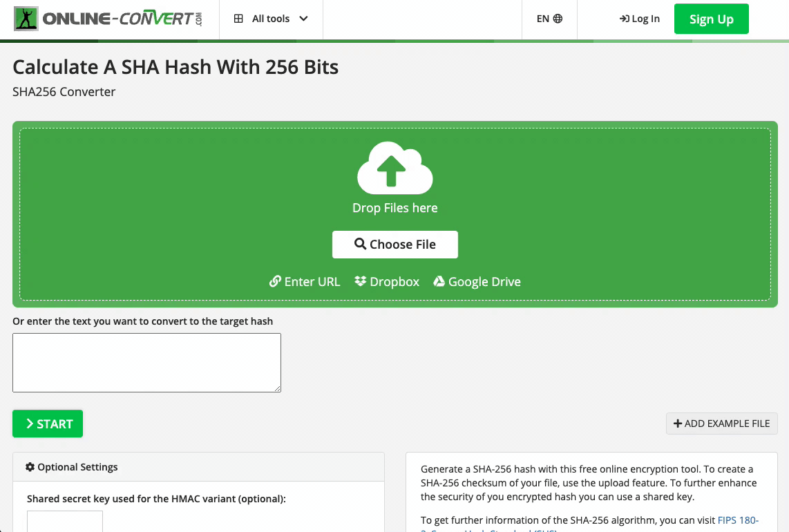

# Tutorial: submitting new template to the "okta/workflows-templates" repo

This is a walkthrough guide of how to submit a new template to the [okta/workflows-templates](https://github.com/okta/workflows-templates) repo. The information needed to create a template is already documented in the README file of the repo. This is just a tutorial on how to do it step by step.

ℹ️ *This tutorial assumes that you're familiar with Okta's Workflows and Workflow Console products and the terminology around them.*

💡 There is a difference between "workflow" and "template". A workflow is what you can interact with inside the Workflows Console. A template on the other hand is the export result of a Workflow. A template is a set of files that describe every aspect of your workflow. A template can be added to the [okta/workflows-templates](https://github.com/okta/workflows-templates) so it can be reused by other users if they want to have the same workflow in their environment. The templates repo is publicly accessible on GitHub, so any templates in there should serve a general purpose and you, as a template create, should expect that it's going to be reviewed (and used) by others.

In this tutorial; we're going to create a template for a workflow called "**generate_unique_emails**". The workflow contains the following:

-   **9 FLOs** in total (**4 main** FLOs + **5 helper** FLOs)
-   **1 stash** (stash is another word for table)


As mentioned above; in this tutorial, we’re creating a template, not a workflow. This tutorial starts with a workflow in hand that we would like to generate a template for.

---

## 1. Create the template folder/file structure

Check out the repo locally on your machine, and start by creating the following file structure for your template inside the workflows root directory:

```
workflows
  ...
  generate_unique_emails
    readme.md
    workflow.json
```

`readme.md` Contains usage/setup instructions and details about the flows contained in the template. It should be written in markdown and follow the structure outlined [here](https://docs.google.com/document/d/1a1jQ9o2am9pBfx0LsexiQ0HW8qyOU7WFAEg1Eevjinc/edit). The more detailed information you include in the readme file, the easier it would be for the future template consumers to reason about decisions and use your template

`workflow.json` This file structure is fully documented in [Step 2 of the README of the repo](https://github.com/okta/workflows-templates#step-2-create-the-metadata). You'll need to populate some of the fields by yourself, but the `details` field should be automatically populated by NodeJS scripts that exist already in the repo.

After populating the fields and running the scripts and instructions in the README, the `workflow.json` file should look like the following:

```json
{
  "name": "generate_unique_emails",
  "title": "Generate Unique Emails",
  "description": "To onboard users in an organization, IT needs to generate unique email addresses for their end users in downstream applications like Office365 and G Suite. This flow generates the unique email address for all the users onboarded into Okta.",
  "connectors": [
    "okta",
    "office365admin",
    "googledirectory"
  ],
  "details": {
    "flos": [
      {
        "id": "e7e5a964-e7c4-4f9f-81b4-d5fdf618579c",
        "name": "Generate-ProxyAddress",
        "type": "HELPER"
      },
      {
        "id": "55429600-4807-4286-9b4a-8ca72f551b15",
        "name": "EmailDomainmatch",
        "type": "HELPER"
      },
      {
        "id": "6755c858-cac9-4df4-b177-f8ddf55dc611",
        "name": "003-CSUB-emailDeDuplication-V2",
        "type": "HELPER"
      },
      {
        "id": "c09215b0-3aaa-48f9-bad0-e1f8dac9c310",
        "name": "004-CSUB-filterCompareLength-V2",
        "type": "HELPER"
      },
      {
        "id": "f2c34fd5-3b5a-46f2-b288-b2ab9b4a1a74",
        "name": "022-SUB-getEmailPrefix-V1 ",
        "type": "HELPER"
      },
      {
        "id": "e3bd1c90-267d-4f19-bbd5-18a0bc667c48",
        "name": "Okta-New-Email-Generation",
        "type": "MAIN"
      },
      {
        "id": "f86976db-68d1-4622-a2aa-7da51a689724",
        "name": "O365-Email-Generation",
        "type": "MAIN"
      },
      {
        "id": "c900ce0a-ff08-4fbc-9c6f-c40918f7c4a6",
        "name": "Google-Email-Generation",
        "type": "MAIN"
      },
      {
        "id": "f94b1e29-5bd7-4b51-8804-0ed3348b525b",
        "name": "MultiDomain-Email-Generation",
        "type": "MAIN",
      }
    ],
    "flowCount": 9,
    "helperFlowsCount": 5,
    "mainFlowsCount": 4,
    "stashCount": 1
  },
  "links": [
    {
      "title": "Video Walk-through",
      "destination": "https://www.youtube.com/watch?v=3PfGBrtF5uw"
    },
    {
      "title": "Setup Documentation",
      "destination": "https://github.com/okta/workflows-templates/blob/master/workflows/generate_unique_emails/readme.md"
    }
  ]
}
```

## 2. Export your workflow from Workflow Console

Go to the folder containing your workflow in Workflow Console, then click on the folder’s settings icon, and click on ⬇️ Export > Download:


Because the Export functionality in Workflow Console is used for multiple purposes in the platform, that downloaded file’s name and extension need modification before porting to our template. Rename the downloaded file to `workflow.flopack` and move it to your template directory.

This is our file structure so far:

```
workflows
  ...
  generate_unique_emails
    readme.md
    workflow.json
    workflow.flopack
```

---

## 3. Generate FLO screenshots for your template

FLO screenshots are fully documented in the README file of the repo under Step 2 as well. In this tutorial, we're going to use [puppeteer](https://github.com/puppeteer/puppeteer) in headless mode to generate the screenshots. The reason behind that is that our FLOs are huge and contain a lot of cards spanning horizontally and vertically in the browser, using the browser only to generate the screenshots would be challenging. The advantage of using a programmatic way like `puppeteer` is we can resize the window size to be as big as we can so we can take a high-resolution screenshot of each FLO.

ℹ️  Using `puppeteer` is optional. Because using `puppeteer` requires some JavaScript knowledge, feel free to use any other tool (or even take the screenshots manually if you want) as long as the result is high-resolution screenshots of your FLOs.

Here is a sample puppeteer script that can be used:

```js
// install dependencies
import puppeteer from "puppeteer";

// navigate to the FLO preview page
const browser = await puppeteer.launch({ headless: true, defaultViewport: null });
const page = await browser.newPage();
await page.goto(${FLO_PREVIEW_PAGE_URL});
await page.waitForNavigation();

// adjust the DOM a bit to hide tooltips, modals, and toasts
await page.waitForSelector("#stage");
const cardContent = await page.$(".card__content");
await cardContent.evaluate((el) => (el.style.maxHeight = "fit-content"));
await page.addStyleTag({
  content:
    ".card__content { max-height: fit-content !important; } .card-warning { display: none; } .toast-layer { display: none; } .menu-layer { display: none; }"
});

// adjust viewport to have the FLO fully visible
await page.setViewport({ width: ${DESIRED_WIDTH}, height: ${DESIRED_HEIGHT} });

// take the screenshot
await page.mouse.move(0, 0);
await stage.screenshot({ path: `${SAVE_PATH}/${FILE_NAME}.png` });
```

_This script is not a copy-paste solution. You will need to adjust it for your needs, but it includes the essential parts of taking a screenshot using puppeteer_

🚩 As mentioned in the README file of the repo, the FILE_NAME should be a SHA256 base64 hash of the screenshot content. You can go to any online tool ([example](https://hash.online-convert.com/sha256-generator)) to convert an image to a hash, then use this hash as the file name for your screenshots. The reasoning behind that is also documented in the README of the repo.



Create a new `resources` folder inside your workflow folder and place the screenshots inside it.

Our template file/folder structure should look like this:

```
workflows
  ...
  generate_unique_emails
    readme.md
    workflow.json
    workflow.flopack
    resources
      RFliELrq_V1haHNw3MhUzD7upfzV3BKXY3sSdKYRSwQ.png
      6EKPeI0FsbLZZ4fHBpvYoi2Vd5q5OAni5VXmn3mN7Yk.png
      zjXxpyHh8h20RZcoV3j97SoRfquYSdzMtAz1Ukpa4k0.png
      Aw7jkB5Yvs9W9xaE8Gn97nKeOwW1PgXAjX43MvOkYhg.png
      EK9cBZxdf8K1U4tolT7QII870_WCS9VQ35WgTxjyJ6M.png
      2E_dvn4XdMQPIOxed9_HMC6JAZyhxOj0bA7R4Sk_7ZQ.png
      R8atpAX-WbV5xkl3jbwCQT4VdQ9iTkP-6eY3-K4J1gk.png
      5DYVFil2fCEJhuA7VPdjvFTSBOD3PiNWtj0L_y7of20.png
      fwMvXa8JP9LJy_sZKhoB3-KcMbTdwGZzWXNSPJYGhKk.png
```
The next step is to go to the workflow.json file and add a screenshot URL for each FLO. The screenshot URL follows the pattern `https://d78vv2h34ll3s.cloudfront.net/static/catalog/workflows/${WORKFLOW_NAME}/resources/${SCREENSHOT_HASH}.png`

🟡 **Remember that there is an entry for each FLO in the workflow.json file at the details.flos field, and you want each screenshot to be associated with its FLO. So figure out a way to associate each screenshot hashed file name to its corresponding FLO.**

The `details.flos` field of `worflow.json` should look like the following:

```js
{
  "flos": [
      {
        "id": "e7e5a964-e7c4-4f9f-81b4-d5fdf618579c",
        "name": "Generate-ProxyAddress",
        "type": "HELPER",
        "screenshotURL": "https://d78vv2h34ll3s.cloudfront.net/static/catalog/workflows/generate_unique_emails/resources/RFliELrq_V1haHNw3MhUzD7upfzV3BKXY3sSdKYRSwQ.png"
      },
      {
        "id": "55429600-4807-4286-9b4a-8ca72f551b15",
        "name": "EmailDomainmatch",
        "type": "HELPER",
        "screenshotURL": "https://d78vv2h34ll3s.cloudfront.net/static/catalog/workflows/generate_unique_emails/resources/6EKPeI0FsbLZZ4fHBpvYoi2Vd5q5OAni5VXmn3mN7Yk.png"
      },
      {
        "id": "6755c858-cac9-4df4-b177-f8ddf55dc611",
        "name": "003-CSUB-emailDeDuplication-V2",
        "type": "HELPER",
        "screenshotURL": "https://d78vv2h34ll3s.cloudfront.net/static/catalog/workflows/generate_unique_emails/resources/zjXxpyHh8h20RZcoV3j97SoRfquYSdzMtAz1Ukpa4k0.png"
      },
      {
        "id": "c09215b0-3aaa-48f9-bad0-e1f8dac9c310",
        "name": "004-CSUB-filterCompareLength-V2",
        "type": "HELPER",
        "screenshotURL": "https://d78vv2h34ll3s.cloudfront.net/static/catalog/workflows/generate_unique_emails/resources/Aw7jkB5Yvs9W9xaE8Gn97nKeOwW1PgXAjX43MvOkYhg.png"
      },
      {
        "id": "f2c34fd5-3b5a-46f2-b288-b2ab9b4a1a74",
        "name": "022-SUB-getEmailPrefix-V1 ",
        "type": "HELPER",
        "screenshotURL": "https://d78vv2h34ll3s.cloudfront.net/static/catalog/workflows/generate_unique_emails/resources/EK9cBZxdf8K1U4tolT7QII870_WCS9VQ35WgTxjyJ6M.png"
      },
      {
        "id": "e3bd1c90-267d-4f19-bbd5-18a0bc667c48",
        "name": "Okta-New-Email-Generation",
        "type": "MAIN",
        "screenshotURL": "https://d78vv2h34ll3s.cloudfront.net/static/catalog/workflows/generate_unique_emails/resources/2E_dvn4XdMQPIOxed9_HMC6JAZyhxOj0bA7R4Sk_7ZQ.png"
      },
      {
        "id": "f86976db-68d1-4622-a2aa-7da51a689724",
        "name": "O365-Email-Generation",
        "type": "MAIN",
        "screenshotURL": "https://d78vv2h34ll3s.cloudfront.net/static/catalog/workflows/generate_unique_emails/resources/R8atpAX-WbV5xkl3jbwCQT4VdQ9iTkP-6eY3-K4J1gk.png"
      },
      {
        "id": "c900ce0a-ff08-4fbc-9c6f-c40918f7c4a6",
        "name": "Google-Email-Generation",
        "type": "MAIN",
        "screenshotURL": "https://d78vv2h34ll3s.cloudfront.net/static/catalog/workflows/generate_unique_emails/resources/5DYVFil2fCEJhuA7VPdjvFTSBOD3PiNWtj0L_y7of20.png"
      },
      {
        "id": "f94b1e29-5bd7-4b51-8804-0ed3348b525b",
        "name": "MultiDomain-Email-Generation",
        "type": "MAIN",
        "screenshotURL": "https://d78vv2h34ll3s.cloudfront.net/static/catalog/workflows/generate_unique_emails/resources/fwMvXa8JP9LJy_sZKhoB3-KcMbTdwGZzWXNSPJYGhKk.png"
      }
    ],
}
```

---

## 4. Push to the repo

Now is the time to give your files a final revision. This is a checklist of the things you should test before pushing your template to the repo:

- Run node scripts/json-details-scripts/details_validator.js to validate your workflow.json file
- Make sure you have screenshots inside the resources folder and their names are hashed based on the content of each screenshot
- Make sure you're using the .png extension for the screenshots. Any other extension won't upload the screenshots to the cloud
- Make sure that the template folder name and the name property in workflow.json are identical

 ✅ **You made it!** add your changes to a new branch and push to the repo. Then you can create a PR according to the process defined in the repo to get your template reviewed and tested.

 💡 After pushing your branch, the screenshots in the `resources` folder will be automatically uploaded to the cloud and the screenshots URLs will be publicly reachable. Nothing is needed from your side to upload the FLOs screenshots as they will be uploaded automatically on push as part of the repo’s CI/CD jobs.
