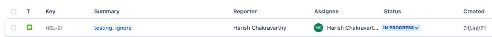
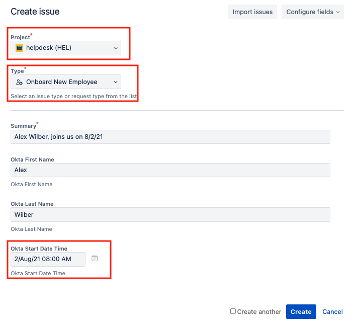

# Automate Account Creation from Jira

## Overview

Onboarding new employees is a complex process that requires inputs from several internal teams and integration across different tools for approval and account creation. In addition, certain businesses may require new employees to complete an orientation or pass a certification
before activating a user account. This complexity adds overhead for IT Admins - keeping track of approvals and then activating each user account on a specific date. How can this process get automated, reduce human error and enhance security posture?

This template provides an example for automating account creation and activation in Okta triggered by an approved service request in Jira.

## Prerequisites

1.  Access to an Okta tenant with Okta Workflows enabled.
2.  Jira Software & Jira Service Management. Access to create new project, service request and custom fields.  
3.  [API Key token for your Atlassian account](https://support.atlassian.com/atlassian-account/docs/manage-api-tokens-for-your-atlassian-account/)

## Setup Steps

### Jira Service Management

A. Create new project

1.  Create a new **Company-managed project** with name **helpdesk** using template IT service management.

B. Create new service request

1.  Project Settings -> Request Types -> Add new request type

2.  Create a **new request type** with the name **Onboard New Employee** and select the issue type as **[System] Service request**.
      

3.  Select the portal group as **Logins and Accounts** (or modify based on organization needs).
      

C. Create the following custom fields:

|                      |                          |
|----------------------|--------------------------|
| **Field Name**           | **Field Type**               |
| Okta First Name      | Text Field (single line) |
| Okta Last Name       | Text Field (single line) |
| Okta Start Date Time | Data Time Picker         |

1.  Settings  ->  Issues.
2.  From the navigation on the left, select **Custom fields**.
3.  Select **Create custom field** in the top-right corner.
4.  Select **All**, and then the custom field type (refer to the table above). Select **Next**.
5.  Name your field (refer to the table above).
6.  Select **Create**. You’ll be taken to the **Screens** page.
7.  Select the screens listed below (HEL is the project created earlier).

8.  Repeat steps 4-7 for each one of the custom fields.
9.  Search custom fields by filter Okta. Result will list three custom fields created.

D. Apply custom fields to service request.
1.  Navigate to the **Onboard New Employee** service request: Jira Service Management -> Project settings (helpdesk project) -> Request Types.
2.  Select **Onboard New Employee**.

3.  Drag and drop custom fields created earlier from **Context fields** to **Description fields**. Click on Save Changes.       

E. Create a test issue 

Create a test issue in the project **helpdesk** of type **Onboard New Employee**.

F. Add resolution Approved

Resolution can be set to **Approved** (for approved onboarding requests) or **Declined** (for denied onboarding requests). This information is then used in creating a query to find  approved onboarding requests.

 
G. Approve test issue
1.  Navigate to the test service request.

      
2.  Select **Resolve this issue**.

3.  Select **Approved** as the **Resolution**.
      

H. Search issues using JQL using [Jira Query Language (JQL)](https://www.google.com/url?q=https://support.atlassian.com/jira-service-management-cloud/docs/use-advanced-search-with-jira-query-language-jql/&sa=D&source=editors&ust=1637340157223000&usg=AOvVaw28z4FtwXAqNWiT6hB3yC2x), find all Service requests of type **Onboard New Employee** in project **helpdesk** with resolution **Approved**. Below is the JQL included in the template.  

`project = helpdesk AND  "Request Type" = "Onboard New Employee" AND
"resolution" = "Approved"`
  
### Okta Workflows
   
#### Brief description of each Flow

-   **Store new employees from Jira**: This Flow is automatically triggered when an issue (that meets the JQL) is updated in Jira. This flow stores information about the new employee in the *New Employee* table.
-   **Find employees starting now**: This Flow should be scheduled (example: every hour) This Flow retrieves rows from **New Employee** table based on new employee start day and time.
-   **Create and activate new employee accounts**: This helper Flow creates and activated new users.
2.  Configured Okta Connection. Steps to configure are posted at [https://help.okta.com/wf/en-us/Content/Topics/Workflows/workflow-connect-your-applications.htm#Authenti](https://help.okta.com/wf/en-us/Content/Topics/Workflows/workflow-connect-your-applications.htm#Authenti)
3.  Configured Jira Connection. Steps to configure are posted at [https://help.okta.com/en/prod/Content/Topics/Workflows/connector-reference/jira/jira.htm](https://help.okta.com/en/prod/Content/Topics/Workflows/connector-reference/jira/jira.htm)
4.  Open Flow **Store new employees from Jira**. Check the **Jira connection**, Project and JQL Query inside **Options**.

5.  **Create and activate new employee accounts**: Check the connections with Okta.
6.  Turn each flow on.
7.  Find employees starting now: Schedule the Flow to meet your business needs.

## Testing

1. Create and approve Jira service request in the **helpdesk** project of type **Onboard New Employee**.  
      

           
2. **Store new employees from JIRA** Flow is automatically triggered. Table stores information needed for new account creation, date & time for activation.

      
3. Flow **Find employee starting now** runs as scheduled to create and activate new employee accounts.  
4. When the new employee start date and time is past the current date and time, new employee account is created and activated. Additionally, **Account Created** column in the **New Employee** table is set to **True**.  
5.  New employee receives a welcome email with a link to activate.

## Limitations & Known Issues

1.  Note that the screenshots in the document may change over time since the time of the recording. If they do, recognize that there may be changes, but focus on the key terms and proceed as best you can.
2.  Keep in mind the [Okta Workflows System Limits](https://help.okta.com/en/prod/Content/Topics/Workflows/workflows-system-limits.htm).
3.  Error handling is not handled in this tutorial.
<!--stackedit_data:
eyJoaXN0b3J5IjpbLTEwNjY5NjI1Ml19
-->
