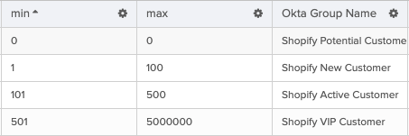
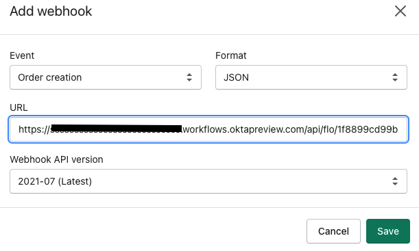
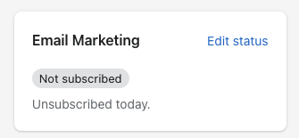
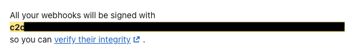

# Automatically Segment Shopify Customers by Spending

## Overview

Consistently maintaining user identity across downstream applications is critical for excellent user experience, compliance and governance. Automatically provisioning downstream applications based on group membership provides a simple and effective solution. This template provides a blueprint to create, update and delete Shopify customers based on group membership in Okta.

## Prerequisites

* Access to an Okta tenant with Okta Workflows enabled.
* Configured Okta Connection. Steps to configure are posted at <a href="https://www.google.com/url?q=https://help.okta.com/en/prod/Content/Topics/Workflows/workflow-connect-your-applications.htm%23Authenti&amp;sa=D&amp;source=editors&amp;ust=1638227432716000&amp;usg=AOvVaw0qgKFgiLruGrlSb94ZkX_O" class="c20">https://help.okta.com/en/prod/Content/Topics/Workflows/workflow-connect-your-applications.htm#Authenti</a>
* Access to create Webhooks in Shopify.
* Access to add custom attributes (Shopify Total Spent & Shopify Orders Count) to an Okta Use Profile.
* Access to create Okta groups
* Shopify customers have an Okta account with custom attributes (item#4)

## Setup Steps
 
1.  Add custom attributes listed below to Okta User Profile. These custom attribute are used to store Shopify customer properties.

    | Display Name      | Variable Name | Data Type |
    | ----------- | ----------- | ----------- |
    | Shopify Total Spent      | shopify_total_spent       | number       |
    | Shopify Orders Count   | shopify_orders_count        | number       |

2.  In the Configuration table, provide the min and max spending threshold and the appropriate Okta Group Name.
    

3.  Create an Okta Group for each of the Okta Group Name listed in the Configuration table (e.g. Shopify VIP Customer, Shopify New Customer).

4.  Enable each of the flows for this template.

5.  Run the Flow Retrieve All Okta Groups. This Flow will update the Okta Group Id column in the Configuration table.

6.  Expose Flow Shopify Orders as Webhook. Note the Invoke URL.

7.  In Shopify, navigate to Settings -> Notifications. Click Create Webhook. Create 3 Webhooks for event Order creation, Order cancellation and Order update. Provide the Invoke URL (step 6) in the URL field. Select Format as JSON. Select Latest API version.  
      
    

    

8.  Add Shopify Secret in table Shopify Webhook Signature. In Shopify, navigate to Settings -> Notifications. Scroll down to the Webhooks section to find the secret all your webhooks will be signed with.
         

    

## Testing

* Scenario 1: Create a new Order in Shopify. In this example, the customer created their first order with a total spend of $45.50. Customer was moved to Okta Group **Shopify New Customer** and customer profile updated with total spend and orders.  

* Scenario 2: Update an existing order in Shopify. In this example, the customer's first order got updated with a total spend of $25.50. Customer should remain in the Okta Group **Shopify New Customer**, however the customer's profile updated with total spend and orders.

## Limitations & Known Issues

* Note that the screenshots in the document may change over time since
    the time of the recording. If they do, recognize that there may be
    changes, but focus on the key terms and proceed as best you can.

* Keep in mind the Okta Workflows System Limits
    <a href="https://www.google.com/url?q=https://help.okta.com/en/prod/Content/Topics/Workflows/workflows-system-limits.htm&amp;sa=D&amp;source=editors&amp;ust=1638227432726000&amp;usg=AOvVaw1w4PSXePez41foQBL9vlaI" class="c20">https://help.okta.com/en/prod/Content/Topics/Workflows/workflows-system-limits.htm</a>.

* Error handling is not handled in this tutorial.
