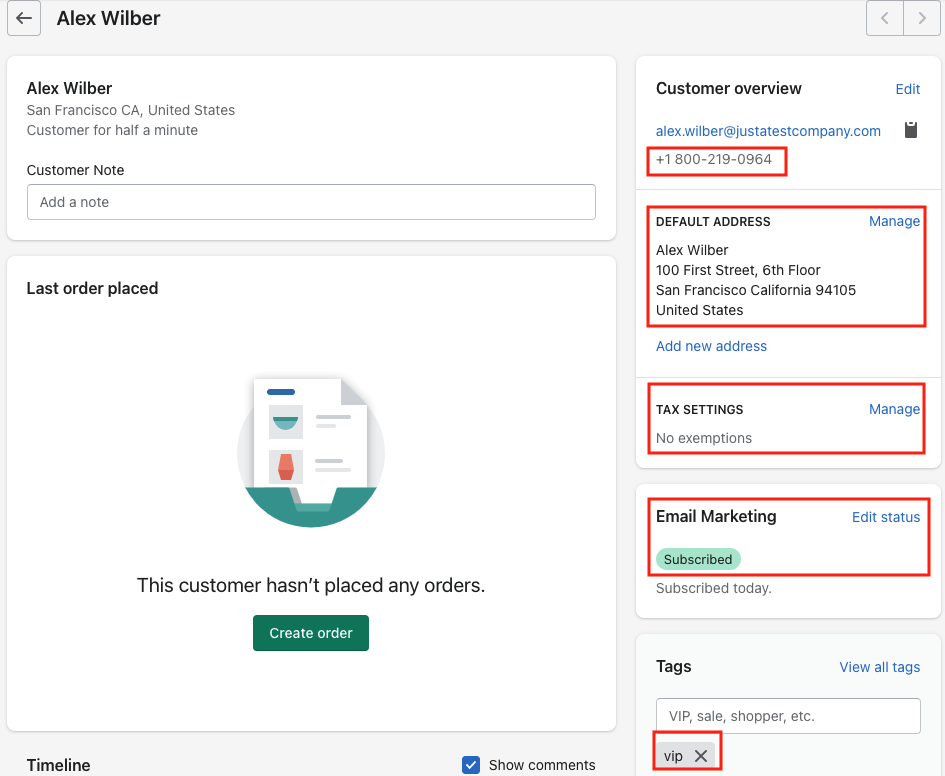

# Automatically Sync Shopify Customer Identity

## Overview
Consistently maintaining user identity across downstream applications is critical for excellent user experience, compliance and governance. Automatically provisioning downstream applications based on group membership provides a simple and effective solution. This template provides a blueprint to create, update and delete Shopify customers based on group membership in Okta.

## Prerequisites
* Access to an Okta tenant with Okta Workflows enabled.
* Configured Okta Connection. Steps to configure are posted at
    <a href="https://www.google.com/url?q=https://help.okta.com/en/prod/Content/Topics/Workflows/workflow-connect-your-applications.htm%23Authenti&amp;sa=D&amp;source=editors&amp;ust=1638297326124000&amp;usg=AOvVaw334l-oKIT6vDM3BICmHGee" class="c28">https://help.okta.com/en/prod/Content/Topics/Workflows/workflow-connect-your-applications.htm#Authenti</a>
* Configured Shopify Connection. More information at
    <a href="https://www.google.com/url?q=https://help.okta.com/en/prod/Content/Topics/Workflows/connector-reference/shopify/shopify.htm&amp;sa=D&amp;source=editors&amp;ust=1638297326124000&amp;usg=AOvVaw3BtGy-zS8EUHqPdyc0Sz_i" class="c28">https://help.okta.com/en/prod/Content/Topics/Workflows/connector-reference/shopify/shopify.htm</a>
* Access to add custom attributes to an Okta Use Profile.
* Access to create Okta groups.

## Setup Steps
1. Add custom attributes listed below to Okta User Profile. These custom attribute are used to store Shopify customer properties.
    * shopify_accepts_marketing (boolean): Customer has consented to receive marketing material via email
    * shopify_tax_exempt (boolean): Customer is exempt from paying taxes on their order
    * shopify_tags (string): Tags created by Shopify store owner for customer
    * shopify_customer_id (string): Customer id in Shopify
    * Shopify_default_address_id (string): Default address id for customer in Shopify
2. Add Attributes listed below to the Customer Account Attributes data table. They are Variable Name of Base and Custom attributes in Okta, which we monitor when a user profile is updated. Any change automatically triggers a customer profile sync in Shopify.
    * primaryPhone
    * email
    * lastName
    * firstName
    * shopify_tax_exempt
    * shopify_tags
    * shopify_accepts_marketing  
3. Add Attributes listed below to the Customer Shipping Attributes data table. They are Variable Name of Base attributes in Okta, which we monitor when a user address is updated. Any change automatically triggers a default customer address sync in Shopify.
    * streetAddress
    * City
    * State
    * countryCode
    * zipCode  
4.  Create an Okta group called Shopify. When a user is added to the Shopify group, the templates will automatically create the user in Shopify as a Shopify customer.
5.  Check the Okta and Shopify connections in each of the Flows
6.  Enable each flow in the folder.

## Testing

Scenario 1: Create a new Okta user and add membership to the Okta group **Shopify** or add an existing user to group Shopify.  

* In the API Payload to create a new Okta user in a specific group, add additional Shopify attributes, shopify_accepts_marketing, shopify_tax_exempt and shopify_tags.
* The phone number (primaryPhone) must be in E.164 Format (i.e+18002190964).
* Inside Okta, visit the user’s profile. User profile attributes updated with Shopify attributes, Shopify customer id and Shopify address ID.  
* Inside Shopify, the new customer is created.

 

Scenario 2:  Update the Okta user attribute shopify_accepts_marketing to false.
* Inside Okta, visit the user's profile. The Okta user’s profile attribute should now be updated.  
* Inside Shopify, Email Marketing status updated.

 

Scenario 3: Modify the user address  
* Inside Okta, navigate to the Okta user’s profile. The Okta user’s profile attribute should now be updated.  
* Inside Shopify, the default address should be updated.  
      
 

Scenario 4: Remove the Okta user from the Okta group Shopify  
* Inside Okta, user removed from group Shopify.
* Inside Shopify, the user should be deleted.

## Limitations & Known Issues
* Note that the screenshots in the document may change over time since the time of the recording. If they do, recognize that there may be changes, but focus on the key terms and proceed as best you can.
* Keep in mind the Okta Workflows System Limits
<a href="https://www.google.com/url?q=https://help.okta.com/en/prod/Content/Topics/Workflows/workflows-system-limits.htm&amp;sa=D&amp;source=editors&amp;ust=1638297326148000&amp;usg=AOvVaw0EzZ7vaepugWX2F_MFS8la" class="c28">https://help.okta.com/en/prod/Content/Topics/Workflows/workflows-system-limits.htm</a>
* This tutorial does not handle email address change
* Error handling is not handled in this tutorial

## Additional Resources

* Shopify Customer API <a href="https://www.google.com/url?q=https://shopify.dev/docs/admin-api/rest/reference/customers/customer&amp;sa=D&amp;source=editors&amp;ust=1638297326149000&amp;usg=AOvVaw2MOzTQlL_X8fSScJo3mB6h" class="c28">https://shopify.dev/docs/admin-api/rest/reference/customers/customer</a>
- Shopify Customer Address API <a href="https://www.google.com/url?q=https://shopify.dev/docs/admin-api/rest/reference/customers/customer-address&amp;sa=D&amp;source=editors&amp;ust=1638297326150000&amp;usg=AOvVaw0EGJ3DUnRmivgVJg2FtkFp" class="c28">https://shopify.dev/docs/admin-api/rest/reference/customers/customer-address</a>
      
