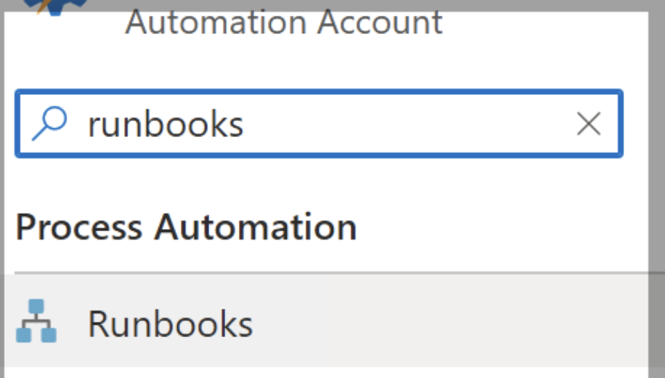
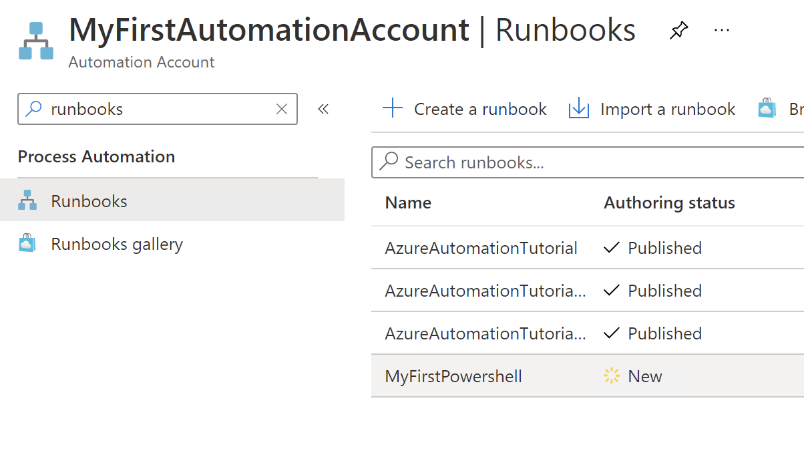
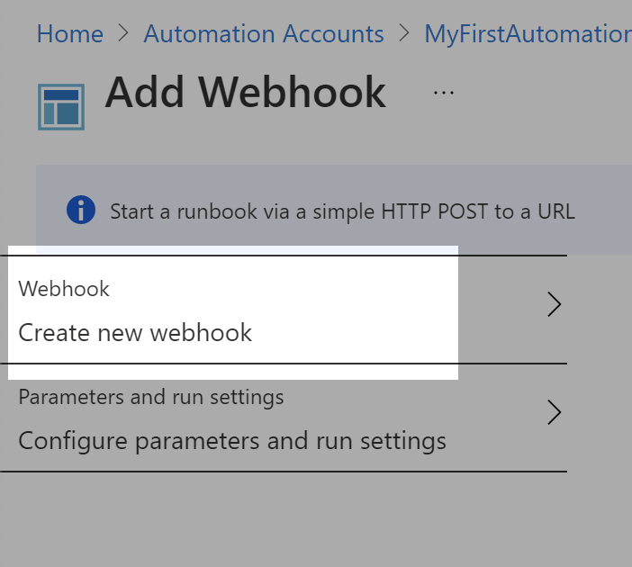
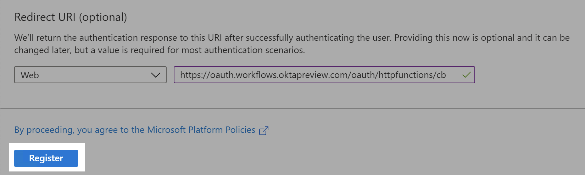

# Execute  On-Premise PowerShell  with Okta Workflows

------------------------------------------------------------------------

## 

## Overview

Microsoft PowerShell is used for many different use
cases, from system management, networking, Windows, and identity. With
regards to Identity Management, PowerShell is commonly used as part of
the joiner, mover, and leaver processes to manage Microsoft
Technologies, and for a small subset of use cases, it performs
on-premises operations such as creating an Exchange mailbox.

With Okta, you can execute PowerShell on-premises with
a combination of Okta Workflows + Azure Automation. Azure Automation
delivers a cloud-based automation service that supports automation
across Microsoft Azure, on-premises non-Azure, and hybrid
environments.

This guide gives  IT
administrators what they need to incorporate PowerShell execution into
the user’s lifecycle from the Okta Identity Cloud.

## Before you get started

For this particular use case, PowerShell will set the
log-on hours locally on the Windows Server. You can make any necessary
changes to invoke your own PowerShell and deliver any other use case
that requires the execution of a PowerShell on-premises.

#### Pre-requirements

<!-- -->

1.  The configuration and screenshots captured were
    taken from a Windows Server 2016 DataCenter on AWS configured as an
    AD Domain Controller

<!-- -->

2.  Azure Automation is only available through a
    subscription plan.
3.  During the step-by-step instructions a particular
    naming convention is used when creating the objects at Microsoft
    Azure, if by any reason you use a different naming convention, make
    the appropriate changes in all of the commands and references.
    Otherwise the solution will not be able to link back to the objects
    you are creating.
4. Make sure the server where the Azure Connected Machine agent is installed has outbound https 443 traffic access allowed and Local Administrator privileges for the account you are using. On that server, it is suggested to set as default Chrome or Edge browsers (IE with Enhanced Security option turned on is problematic as the script execution requires authentication with Azure). 

## Step-by-Step instructions

### Create a new Automation Account

1.  Log-in to  
    <a href="https://www.google.com/url?q=https://portal.azure.com&amp;sa=D&amp;source=editors&amp;ust=1624896848561000&amp;usg=AOvVaw0EaArFLb30LNnf6fBJkrxP" class="c12">https://portal.azure.com</a>
      
2.  In the Microsoft Azure portal search for “
    Automation Accounts ”.

3.  Click on “ +
    Create ” to add a new automation
    account.

4.  Name the new Automation Account “ OktaPowershellAutomationAccount ”

5.  Click on “Create New” Resource Group and name the Resource Group “AAAutomationRG”

6.  And then click “OK” to create the resource group

7.  Click “Review+Create” to create Automation Account with the default values

8.  Click “Create” and then go to the automation account resource

### Configure Hybrid Runbook Worker

1. Under Automation Account - on the left navigation bar under “Process Automation” - select “Hybrid worker groups” and click “+ Create hybrid worker group” - name the group “AAHybridWorkerGroup”.

2. Create hybrid worker group with default settings 

3. The result is as follows for the Automation Account you created: 

### Add machine with Azure Arc

1. In the Azure portal search bar, type "Azure Arc" and select the service.
2. In the left navigation bar - Select “Infrastructure” > “Machines” and Click on “+ Add/Create”.
3. Click on “Add a Machine”

4. Select “Add a single server” and “Generate Script”

5. To Add a server with Azure Arc, select the resource group you created earlier and the default settings and click “Next”

6. Set tag values as desired

7. Copy the script and execute the script that Microsoft has generated on the Windows machine - recommend using the Windows Powershell ISE application as Administrator

8. You will be asked to authenticate to Azure during the execution of the script 
style="overflow: hidden; display: inline-block; margin: 0.00px 0.00px; border: 1.33px solid #268bd2; transform: rotate(0.00rad) translateZ(0px); -webkit-transform: rotate(0.00rad) translateZ(0px); width: 384.00px; height: 103.68px;">

9. At the end of the script execution,  you will see an informational message that the  machine is connected to Azure
style="overflow: hidden; display: inline-block; margin: 0.00px 0.00px; border: 1.33px solid #268bd2; transform: rotate(0.00rad) translateZ(0px); -webkit-transform: rotate(0.00rad) translateZ(0px); width: 384.00px; height: 103.68px;">

10. In the Azure portal, navigate to Automation Account you created and then the Hybrid worker group. 
style="overflow: hidden; display: inline-block; margin: 0.00px 0.00px; border: 1.33px solid #268bd2; transform: rotate(0.00rad) translateZ(0px); -webkit-transform: rotate(0.00rad) translateZ(0px); width: 384.00px; height: 103.68px;">

11. Click on "Hybrid Workers" and click "+Add".
style="overflow: hidden; display: inline-block; margin: 0.00px 0.00px; border: 1.33px solid #268bd2; transform: rotate(0.00rad) translateZ(0px); -webkit-transform: rotate(0.00rad) translateZ(0px); width: 384.00px; height: 103.68px;">

12. Associate the machine you just configured with the hybrid worker group you created earlier.
style="overflow: hidden; display: inline-block; margin: 0.00px 0.00px; border: 1.33px solid #268bd2; transform: rotate(0.00rad) translateZ(0px); -webkit-transform: rotate(0.00rad) translateZ(0px); width: 384.00px; height: 103.68px;">

13. At this point if you navigate to your Hybrid Worker Group - your Hybrid Worker Group will show 1 Hybrid Worker associated under the “Details” section
style="overflow: hidden; display: inline-block; margin: 0.00px 0.00px; border: 1.33px solid #268bd2; transform: rotate(0.00rad) translateZ(0px); -webkit-transform: rotate(0.00rad) translateZ(0px); width: 384.00px; height: 103.68px;">

### Configure Runbooks + Webhooks

1.  Back at Microsoft Azure portal, search for
    automation accounts.

2.  Select “ OktaPowershell AutomationAccount ”.

3.  In the Search field, type  runbooks  and select “
    Runbooks ” from the
    pane.

4.   Click “ + Create a
    runbook ”.

5.  Enter a name for the runbook “ OktaPowerShell ” and choose
    “ PowerShell”  as
    the Runbook type.
6.  Click “Create”.

7.  You should automatically be taken to the “
    Edit PowerShell Runbook ”
    UI, if you already see the below screen you can jump to 
    step 11.

8.  Go back to your “ OktaPowershellAutomationAccount ”
    at “ Automation Accounts ”.
9.  In the Search field, type  runbooks  and select “
    Runbooks ” from the pane,
    select the newly created “ OktaPowerShell ”.

10. Click “Edit”.

11. Copy and paste the shell script below into the
    UI .

<table class="c46">
<colgroup>
<col style="width: 100%" />
</colgroup>
<tbody>
<tr class="odd c36">
<td class="c44">
## Title:           setlogonhours.ps1

# First things first

 param (

        [Parameter(Mandatory=$true)]

        [object] 

        $WebhookData 

     )

  Import-Module ActiveDirectory

if (-not (Get-Module ActiveDirectory)){

}

Import-Module Microsoft.PowerShell.Utility

if (-not (Get-Module Microsoft.PowerShell.Utility)){

}

## Example 1 logon hours // 7:00 a.m. – 7:00 p.m. Monday – Friday, and 7:00 a.m. to 6:00 p.m. Saturday

[byte[]]$hours1 = @(0,0,0,0,224,255,1,224,255,1,224,255,1,224,255,1,224,255,1,224,255)

 

&lt;#

Each day of the week has 3 blocks. Each block is 8 hours.

Segment 1: 6pm-2am; Segment 2: 2am-10am; Segment 3: 10am-6pm

Note: I am in CST. These segments may be mapped to different timeframes if you are in a different time zone.

Each 1 hour block in the GUI represents 1 bit in a binary octet, but reversed order. Thus, a decimal value of 7 (binary value of 00000111) would equate to the first three hours of a segment. If the 7 were in segment 3 it would equate to 10am-1pm.

 

Example:

 

[byte[]]$hours = @(

    255,255,255, #Sun, 6pm previous day to 6pm present day

    255,255,255, #Mon

    255,255,255, #Tue

    255,255,255, #Wed

    255,255,255, #Thu

    255,255,255, #Fri

    255,255,255  #Sat

)

#&gt;

if ($WebhookData){

    $inObject = ConvertFrom-Json -InputObject $WebhookData.RequestBody

    $memberSamAccountName = $inObject.member 

    write-output $memberSamAccountName

}

Get-ADUser -Identity $memberSamAccountName 

Set-ADUser -Identity $memberSamAccountName -Replace @{logonhours = $hours1}

Write-Host "Setting Example 1 logon times for $member"

           

 

Get-ComputerInfo
</td>
</tr>
</tbody>
</table>

Note:  The code
above could be replaced by ANY code that uses SamAccountName to identify
the user and perform some particular operation, from creating a local
mailbox to populating the proxyAddress attribute.

12. Click “ Publish
    ” to publish your new code.

13. Click “ Yes ” to proceed and publish the code.

14. After publishing, In the Search field, type 
    webhooks  and select
    “ Webhooks ” from
    the pane.

A webhook allows an external service (in our
case Okta Workflows) to start a particular runbook in Azure Automation
through a single HTTP request. Microsoft reference on webhooks is
 
<a href="https://www.google.com/url?q=https://docs.microsoft.com/en-us/azure/automation/automation-webhooks&amp;sa=D&amp;source=editors&amp;ust=1624896848618000&amp;usg=AOvVaw3oobZA2A6XBUXS--06aQqa" class="c12">here</a>
 .

15. Select “ + Add
    Webhook ”.

16. Select “ Create new
    webhook ”.

17. Name your new Webhook as “ OktaPowershellOnPremiseWebhook ”.

18. Copy and paste the URL  for
    later use,  you won’t be able to
    retrieve this URL after clicking OK .
19. Click “ OK ”.
20. Select “ Configure
    parameters and run settings ”.

21. Provide “ \[EmptyString\] ” as the
    WEBHOOKDATA

22. Select “ Hybrid
    Worker ” for the Run Settings.

23. Choose “AAAutomationRG” as the Hybrid Worker group.

24. Click “ OK ”.
25. Click “ Create ”.

### New App Registration

In order to monitor the output of the Azure Automation
Jobs, we need to create an App Registration.

1.  In the Azure Portal, search for “ App Registrations ”.

2.  Click “+  New
    registration ”.
3.  Name the new application “ OktaPowershellAzureADAppRegistration ”.
4.  Select the supported account types according to
    your security policies.

5.  The redirect URI will be one of the two options
    below, depending on the Okta environment you are using:

<!-- -->

1.  Okta Preview:  
    <a href="https://www.google.com/url?q=https://oauth.workflows.oktapreview.com/oauth/httpfunctions/cb&amp;sa=D&amp;source=editors&amp;ust=1624896848624000&amp;usg=AOvVaw0X19DYq3NXyaHIOYDlKv2k" class="c12">https://oauth.workflows.</a>
     
    <a href="https://www.google.com/url?q=https://oauth.workflows.oktapreview.com/oauth/httpfunctions/cb&amp;sa=D&amp;source=editors&amp;ust=1624896848625000&amp;usg=AOvVaw0E1QGGpfak5G1__mbmIG8s" class="c12">oktapreview</a>
     
    <a href="https://www.google.com/url?q=https://oauth.workflows.oktapreview.com/oauth/httpfunctions/cb&amp;sa=D&amp;source=editors&amp;ust=1624896848625000&amp;usg=AOvVaw0E1QGGpfak5G1__mbmIG8s" class="c12">.com/oauth/httpfunctions/cb</a>
    
2.  Okta Production:  
    <a href="https://www.google.com/url?q=https://oauth.workflows.okta.com/oauth/httpfunctions/cb&amp;sa=D&amp;source=editors&amp;ust=1624896848626000&amp;usg=AOvVaw34-V5bagHJj8YHAIujx-az" class="c12">https://oauth.workflows.</a>
     
    <a href="https://www.google.com/url?q=https://oauth.workflows.okta.com/oauth/httpfunctions/cb&amp;sa=D&amp;source=editors&amp;ust=1624896848626000&amp;usg=AOvVaw34-V5bagHJj8YHAIujx-az" class="c12">okta</a>
     
    <a href="https://www.google.com/url?q=https://oauth.workflows.okta.com/oauth/httpfunctions/cb&amp;sa=D&amp;source=editors&amp;ust=1624896848626000&amp;usg=AOvVaw34-V5bagHJj8YHAIujx-az" class="c12">.com/oauth/httpfunctions/cb</a>
    

6.  Click “ Register
    ”.

7.  After registering, In the Search field, type
     api permissions  and select “ API
    Permissions ” from the pane.

8.  Select “ API
    Permissions ”, click “ + Add a permission ”.

9.  Click “ Azure Service
    Management ”.

10. Select the  user_impersonation  permission.

11. Click “ Add
    permissions ”.

12. Click “ Grant admin consent
    for \<YourOrganization> ”.

13. Click “ Yes ” to grant consent for the requested permissions.

14. In the Search field, type  certificates & secrets  and
    select “ Certificates & Secrets ” from the pane.

15. Click “ New client
    secret ” to create a new secret for the
    app.

16. Add a description, “ Okta
    Workflows ”, and click “ Add ”.

17. Make a copy of the newly created secret 
    Value .  We will use this information to configure Okta Workflows.
    

18. In the Search field, type  owners  and select “ Owners ” from the pane.

19. And confirm that you are the app owner.

20. In the Search field, type  overview  and select “
    Overview ” from the
    pane.

21. From the overview UI, take note of the following
    fields that will be used later to configure Okta Workflows.

22. For the upcoming steps, take note of the following
    information:

<!-- -->

1.  Directory (tenant) ID .
    Will be referred to as  dirTenantId.
2.  Application (client) ID . Will be referred to as  azureAppClientId .

<!-- -->

23. Construct the following URLs by replacing the
     \<dirTenantId>  placeholders  with the correct
    values. These will be used when we set up the Http Connection
    Setting in  Okta Workflows

<!-- -->

1.  Authorize Path:  https://login.microsoftonline.com/ \<dirTenantId> /oauth2/v2.0/authorize
2.  Access Token:  https://login.microsoftonline.com/ \<dirTenantId> /oauth2/v2.0/token

### Set up Okta Workflows

1.  In Okta Workflows create a new connection
2.  Click “ Connections
    ”

3.  Click “ + New
    Connection ”

4.  From the New Connection window, select API
    Connector.

5.  Create a new Http OAuth Connection named “
    HttpAzureManagementOAuth ”
    as shown below using the information we copied from previous steps,
    plus the information we copied from “ 
    <a href="#ExecuteOnPremisePowerShellwithOktaWorkflows.xhtml#h.6txs6cwo5z37" class="c12">New App Registration</a>
     ”:

<!-- -->

1.  Authorize Path  = 
    
    <a href="#ExecuteOnPremisePowerShellwithOktaWorkflows.xhtml#h.6txs6cwo5z37" class="c12">New App Registration</a>
     ,  step
    23.a;
2.  Access Token  = 
    
    <a href="#ExecuteOnPremisePowerShellwithOktaWorkflows.xhtml#h.6txs6cwo5z37" class="c12">New App Registration</a>
     , s tep
    23.b;
3.  Scope  =
    https://management.azure.com/user_impersonation
    offline_access;

<!-- -->

1.  The scope for user_impersonation is a url-format as
    shown above. The offline_access allows Okta Workflows to retrieve a
    refresh token for a flow instance if the access token has
    expired.

<!-- -->

4.  Client ID  =  
    <a href="#ExecuteOnPremisePowerShellwithOktaWorkflows.xhtml#h.6txs6cwo5z37" class="c12">New App Registration</a>
     , step  22.b
    ( Application (client) ID ) ;
5.  Client Secret  = 
    
    <a href="#ExecuteOnPremisePowerShellwithOktaWorkflows.xhtml#h.6txs6cwo5z37" class="c12">New App Registration</a>
     , step  17 (
    Value ).

<!-- -->

6.  Go to the “ SetLogonHours ” flow. 

7.  Click the connection name for the  API Connector Post .
8.  Click “ +New
    connection ”
9.  Create a new API Connector connection, with name
     HttpAzureManagementNoAuth  and  Auth Type  =  None , and assign this to the HTTP Post.
10. Replace the URL of the  API
    Connector  Post  card  with the Webhook URL that
    you created earlier at  
    <a href="#ExecuteOnPremisePowerShellwithOktaWorkflows.xhtml#h.s6e1y41tjpgr" class="c12">Configure Runbooks + Webhooks</a>
     , step 18 .
11. Save  your changes
12. Go to flow  \[1.1\] Get
    Azure Automation Job Status

13.  Confirm that the  API
    Connector Get  card is using the “
    HttpAzureManagementOAuth ”

14. Update the “Flow Control  Assign ” card, with variable
     subscriptionId ,
    with your Azure Subscription Id (the one that you used to associate
    all of the configurations we’ve done so far). You can retrieve the
    Subscription ID, for your automation account “ OktaPowershellAutomationAccount ”.

15. Make sure the “Text Compose” card references the correct Automation Account name and Resource Group name that you used.

16. Turn on all three flows

## Testing this Flow

1.  The workflow is configured to execute as helper
    flow, which means that it needs to either be invoked by a parent
    flow or be manually executed. To do this, select the “ SetLogonHours ” flow.

2.  And click “ \> Test
    ”, to execute the flow.

3.  Provide a samAccountName from your Active
    Directory.

4.  And click “ Run Test
    ”.
5.  This will submit a request to Azure through our
    Webhook, which will execute our Runbook in our local Hybrid Worker
    (the agent that we installed on our Windows Server machine).
6.  You can track the job, by executing flow “
    \[1.0\] Review Azure Automation Jobs ”. The flow will connect to Azure Management API and
    request a status for the job that we triggered when flow “
    SetLogonHours ” was
    executed.

7.  Once the flow finishes, click the “ Tables ” tab

8.  Select the “ Azure
    Automation Job Tracker ” table, and you will
    find an entry regarding the job that you just created at Azure. Wait
    a couple of minutes and re-execute flow “ \[1.0\] Review Azure Automation Jobs ”, and check the table again until the entry status is
    “ Completed” .
9.  You can also check directly in Active Directory, by
    searching for the user that you used on step 19, and select “
    Account > Logon hours… ”.
    Once the job completes the user logon hours should be similar to the
    image below.

 

10. The template also contains two additional flows
    “ CleanUp.01.Search.Table.Entries
    ” and “ CleanUp.02.Delete.Row ”, used to
    delete old entries from the workflow table. The flow “ CleanUp.01.Search.Table.Entries ”
    is executed daily and you can set the number of days from which
    entries will be deleted, by updating the “ Date & Time Subtract ”
    card.

## Limitations and Known issues

1.  Note that the screenshots in the document may
    change over time since the time of the recording. If they do,
    recognize that there may be changes, but focus on the key terms and
    proceed as best you can. 

Different usage patterns will result in different
costs, the discussion of which is beyond the scope of this document. Be
aware that using this may impact the overall cost of your Okta and Azure
tenant which are your responsibility to track. 

## Additional Resources

-   
    <a href="https://www.google.com/url?q=https://www.okta.com/products/lifecycle-management/&amp;sa=D&amp;source=editors&amp;ust=1624896848656000&amp;usg=AOvVaw0B6jedgitLdR3t8YJvD_t0" class="c12">https://www.okta.com/products/lifecycle-management/</a>
      
-   
    <a href="https://www.google.com/url?q=https://www.okta.com/platform/workflows/&amp;sa=D&amp;source=editors&amp;ust=1624896848657000&amp;usg=AOvVaw2iWSLaQNjc3NqIHkZaCBTC" class="c12">https://www.okta.com/platform/workflows/</a>
      
-   
    <a href="https://www.google.com/url?q=https://docs.microsoft.com/en-us/graph/use-the-api%23:~:text%3DMicrosoft%2520Graph%2520is%2520a%2520RESTful,to%2520Microsoft%2520Graph%2520is%2520changing&amp;sa=D&amp;source=editors&amp;ust=1624896848658000&amp;usg=AOvVaw1Ann9TIU7PoUdpDMx_0uMH" class="c12">https://docs.microsoft.com/en-us/graph/use-the-api#:~:text=Microsoft%20Graph%20is%20a%20RESTful,to%20Microsoft%20Graph%20is%20changing</a>
     . 
-   
    <a href="https://www.google.com/url?q=https://docs.microsoft.com/en-us/azure/automation/automation-webhooks&amp;sa=D&amp;source=editors&amp;ust=1624896848659000&amp;usg=AOvVaw1S0q2AU0gou2tVydOy0YTh" class="c12">https://docs.microsoft.com/en-us/azure/automation/automation-webhook</a>
    
-   https://learn.microsoft.com/en-us/azure/automation/migrate-existing-agent-based-hybrid-worker-to-extension-based-workers
    

## Important Note

Azure Automation Agent-based User Hybrid Runbook Worker (Windows and Linux) will retire on 31 August 2024 and wouldn't be supported after that date. You must complete migrating existing Agent-based User Hybrid Runbook Workers to Extension-based Workers before 31 August 2024.  Please review Microsoft documentation above for details. The steps in this document cover how to set up a new Extension-based worker. 
