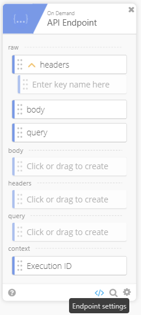
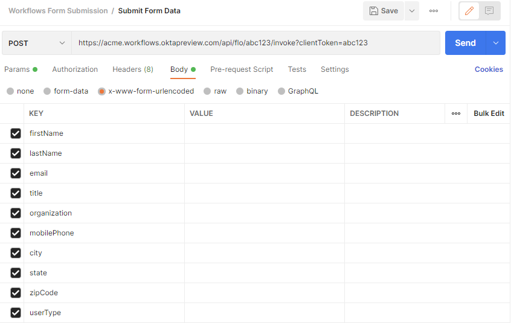
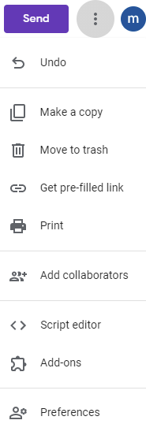
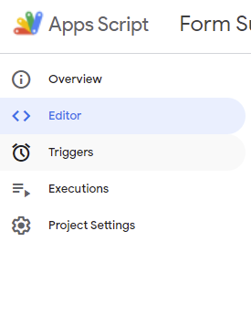
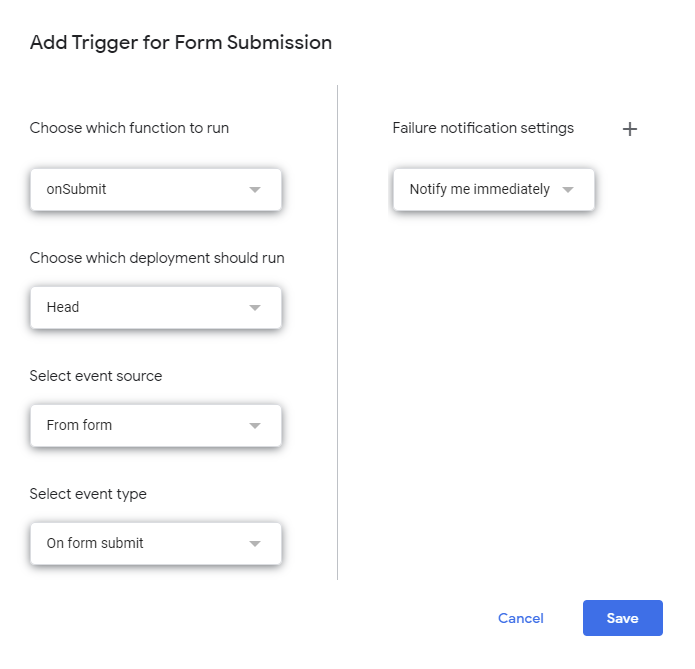
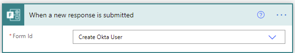
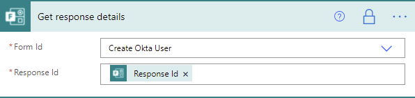
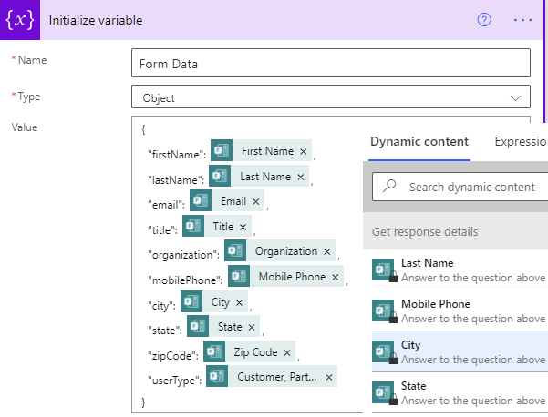
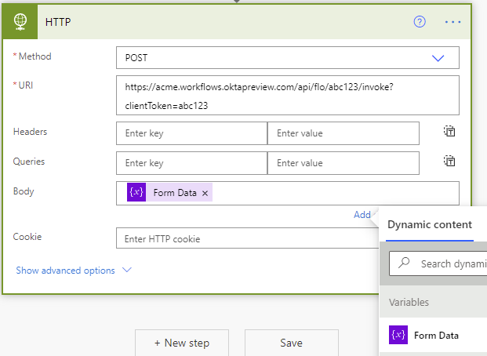

# Submit form data to the Okta Workflows API endpoint

## Overview

A number of cloud platform services allow IT administrators and developers to configure forms that can perform a POST operation to a URL endpoint. The data that is sent by the operation to the Okta Workflows API endpoint can be used to onboard or offboard employees, add or remove users from Okta groups, or take action using any configured Workflows connector. This template demonstrates how these tasks can be completed using Postman, Google Forms, and Microsoft Forms.

## Prerequisites

1.  Access to an Okta tenant with Okta Workflows
    enabled
2.  A configured Okta Connection. To configure a connection, see [Authentication](https://help.okta.com/wf/en-us/Content/Topics/Workflows/connector-reference/okta/overviews/authorization.htm).
3.  Access to Google Forms and Google App
    Script.
4.  Access to Microsoft Forms and Microsoft Power Automate.

## Setup

### Postman

Using Postman, you can emulate a form submission to your
Workflows API Endpoint. In order to import the Postman collection
included in the template, open your Postman application and select
**File** > **Import** and select the Postman collection JSON file.

Enter the Workflows API Endpoint URL from the “Postman
API Endpoint” Workflow. To get this URL, click the
**&lt;/&gt;** icon and copy the **Invoke URL** value in the API Endpoint
Settings.

Once you have the Workflows API endpoint URL, you can
copy and paste the URL into Postman and enter in the keypair values
that will be both sent to the Workflows API endpoint URL and used to create
an Okta user.

### Google Form

Create a Google Form (<a href="https://www.google.com/url?q=https://forms.google.com&amp;sa=D&amp;source=editors&amp;ust=1634840532128000&amp;usg=AOvVaw03C2t-5M-6Iza6eYJ3ASOg" class="c18">https://forms.google.com</a>) with the same fields that are used in the Postman
Collection (First Name, Last Name, and so forth).

Once your Google Form has been created, click on the
ellipses in the upper right corner in your Form editor and select Script
Editor. Within the Google’s Apps Script, fill the name of your Google
Apps Script project at the top. Next, under **Files**, select the `Code.gs`
file. Within this file, you will enter in some basic javascript code that
will gather all of the questions and answers of your form and submit
those values as a payload to your Google Form API Endpoint Workflow
URL.

Use this code with the Script Editor:  

// replace the URL below with the API endpoint in the
Google Form API Endpoint Workflow; this is the only change that is
needed in this code snippet.

var POST\_URL = "https://acme.workflows.oktapreview.com/api/flo/abc123/invoke?clientToken=abc123";

function onSubmit(e) {

    var form =
FormApp.getActiveForm();

    var allResponses = form.getResponses();

    var latestResponse = allResponses\[allResponses.length -
1\];

    var response =
latestResponse.getItemResponses();

    var payload =
{};

    // The For Loop expression
below will generate a JSON object with all of the Questions and Answers
in your form.

    for (var i =
0; i &lt; response.length; i++) {

        var question =
response\[i\].getItem().getTitle();

        var answer =
response\[i\].getResponse();

        payload\[question\]
= answer;

    }

  

    var options =
{

        "method": "post",

        "contentType": "application/json",

        "payload": JSON.stringify(payload)

    };

// The method below will post the questions and answers
payload to the URL specified above.

UrlFetchApp.fetch(POST\_URL, options);

};

------------------------------------------------------------------------

Once you have entered the code block into your `Code.gs`
file, click on the side bar and select **Triggers**.

Click on **Add Trigger** and select the values seen in the
screenshot below. This will allow our Apps Script to run whenever the form is submitted.

That is all the configuration that you need to do
within App Scripts to send the Google Form payload to our Workflows API
endpoint.

To ensure the App Script works when the Google Form is
submitted, fill out your form and navigate to the Google Form API
Endpoint Workflow. Ensure your Workflow is enabled before you submit the
Google Form. Once you submit the Google Form, you should see an entry
in your Flow History.

### Microsoft Forms

Create a Microsoft Form (<a href="https://www.google.com/url?q=https://forms.office.com&amp;sa=D&amp;source=editors&amp;ust=1634840532133000&amp;usg=AOvVaw0QSChD0GZLuT4mONdxbt7t" class="c18">https://forms.office.com</a>) with the same fields that are used in the Postman
Collection (First Name, Last Name, and so forth).

In order to send the contents of our Microsoft Form upon submission, we
are going to need to use Microsoft’s Power Automate application (<a href="https://www.google.com/url?q=https://us.flow.microsoft.com&amp;sa=D&amp;source=editors&amp;ust=1634840532133000&amp;usg=AOvVaw1ugHpq5VklvDOztqPqMGW_" class="c18">https://us.flow.microsoft.com</a>).

Within the Power Automate application, choose to create
a new Automated cloud flow and give your flow a name. Your flow’s
trigger will be when a new response is submitted.

1. Choose the Microsoft Form you just
created.

2. Select the Get response details
action. Select the Form Id that you chose in the previous step and
select Response Id as the Response Id.

3. Select the Initialize variable
action. Name your variable and choose Object for Type. In the value
input field, we will be constructing our JSON object to send to our
Workflows API endpoint URL. You can define the key value as you see fit
but for the pair value, you will need to select from the Dynamic content
list.

4. Select the HTTP action. Choose POST
as the method. In the URI input, enter the API endpoint from the Google
Form API Endpoint Workflow. In the **Body** input, select the variable you
created in the previous step which should be shown in the Dynamic
Content menu under the Variables list.

5. Click **Save** and then click **Test** and
try out your form. If the Microsoft Form submission is successful, you
should see an entry in your Google Form API Endpoint Workflow’s Flow
History.

## Limitations & Known Issues

-   The screenshots in this readme file may
    change over time. If they do,
    recognize that there may be changes, but focus on the key terms and
    proceed as best you can. 
-   Keep in mind the Okta Workflows [System Limits](https://help.okta.com/wf/en-us/Content/Topics/Workflows/workflows-system-limits.htm).
-   Error handling is not addressed in this template.
    
