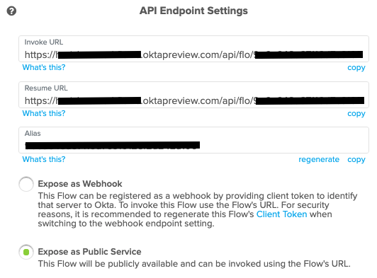
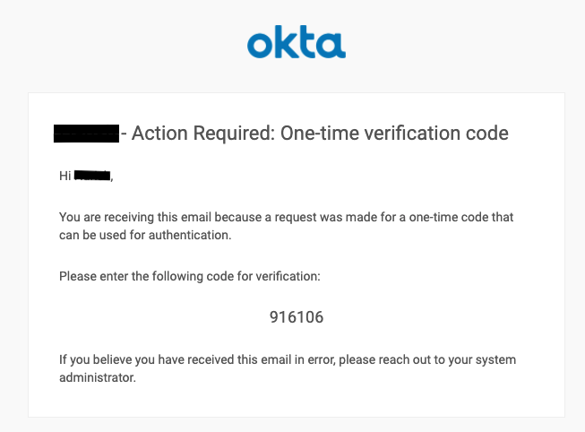

# Hardening customer verification with email factor challenge 

## Objective
Hardening customer identity authentication is critical to improving security and avoiding fraud and should be baked into the customer journey both online and offline - whether it is shopping online or picking up takeout food from your favorite restaurant. Hardening customer identity authentication creates two interesting challenges - validating the identity of the customer beyond traditional static password based authentication to include a reliable time-based one-time password (TOTP) and continuing to provide a frictionless experience without compromising security. 
## How can Okta address this?
[Okta Workflows](https://www.okta.com/platform/workflows/) makes it easy to automate identity processes at scale – without writing code.

Workflows can be used to verify customers using factors that require a challenge and verify operation. In this document we’ll use email factor challenge to verify customers by building two flows.

- Issue an Email Factor Challenge: This flow will accept customer email as input and issue an email factor challenge
- Verify an Email Factor Challenge: This flow will accept customer email and verification code (OTP) as input and verify the email factor challenge.

Both the flows are exposed as API endpoints that can be invoked via command line, browser or included inside an application. Both the endpoints return back the status code (example: 200 is success). An application can then trigger next steps based on the return value, making it easy for developers to verify customers.

### Pre-requirements
- Access to create Okta Workflow templates
- User should be enrolled in email factor
### Setup Steps
#### Flow 1: Issue an Email Factor Challenge

1. In the Admin Console, go to **Workflow > Workflows console**

1. In the Workflows Console, click **New Flow**. Optionally, if you have a folder where you want to store this Flow, open it and click **+New** **Flow**

1. Name your Flow as **Issue an Email Factor Challenge**

1. Click **Add Event**

1. Select **API Endpoint** from Okta Apps menu
1. API Endpoint allows you to create a Flow that is activated via a URL. Any parameters sent within the URL string, can be accessed by creating fields named after the **query** parameter. Create the field **email** to access the value contained within this field.
1. Click **Function**

1. If a query parameter **email** is provided then the flow will continue else, send a meaningful error message.  To accomplish this, select **Branching -> Continue If.** 

1. Drag and drop the **email** field in the API Endpoint card to the **value a** field
1. Set **comparison** to **not equal**

1. Enter **error: include email** in the **message** field 

1. Click **App Action** -> **Okta** -> **Find Users**

1. Set **Result Set** to **First Matching Record** and  **Save.** 

1. Accept default selected fields (Raw Output, ID, Status) and click **Save**
1. Drag and drop the **email** field in the API Endpoint card to the **Query** field
1. If a customer was found with the email provided then the flow will continue else, send a meaningful error message.  To accomplish this, select **Function -> Branching -> Continue If.** 

1. Drag and drop the **ID** field in the Find Users card to the **value a** field
1. Set **comparison** to **not equal**

1. Enter **error: invalid email** in the **message** field 

1. List all factors the customer is enrolled in by calling the factors endpoints. To construct this endpoint select **Function -> Text -> Concatenate**
1. Enter **/api/v1/users/** in **text 1**. Drag and drop the **ID** field in the Find Users card to **text 2 and** click inside the grey box to enter **/factors**
1. Call the factors endpoint by clicking **App Action** -> **Okta** -> **Custom API Action.** Set **Request Type** to **Get** and **Save.**

1. Uncheck **Request Query** and Save
1. Drag and drop the **output** field in the **Text Concatenate** card to the **Relative URL** field
1. Enter **"content-type": "application/json","Accept": "application/json"** inside {} in **Headers** field
1. To parse the API response for the email factor **id** click **Function->List->Find**
1. Drag and drop the **Body** from **Okta Custom API Action card** to **list** field. Set **operator** to **equal to.** Enter in the **path** textbox **factorType** and in the **comparison** textbox **email.** Enter key name as  **id** to extract the id of the email factor

1. Construct endpoint to issue email factor challenge by selecting **Function -> Text -> Concatenate**
1. Enter **/api/v1/users/** in text 1. Drag and drop **ID** field in the **Find Users** card to **text 2**. Click inside the grey box to enter **/factors/**. Click inside the grey box and provide a unique name **id.** Drag and drop **id** from Okta Custom API Card to **id** field. Click inside the grey box and enter a unique name `verify` and then enter `/verify`

1. Issue email factor challenge by clicking **App Action** -> **Okta** -> **Custom API Action.** Set **Request Type** to **POST** and **Save.**

1. Uncheck **Request Query** and Save

1. Drag and drop the **output** field in the **Text Concatenate** card to the **Relative URL** field
1. Enter **"content-type": "application/json","Accept": "application/json"** inside {} in **Headers** field
1. To return back the status of the API call select **Function -> Flow Control -> Return Raw**

1. Drag and drop the **Status Code** field from **Okta Custom API Action** card to **body**

1. Save the flow
1. Toggle the **Flow is OFF** switch to **Flow is ON**
1. Navigate back to the folder where your flow is stored by clicking on the folder icon in the breadcrumb
1. Click on the **Gears** icon next to your flow
1. Click **API Access**

1. **API Endpoint Settings** for the flow is displayed. Select **Expose as Public Service**. Copy the value from **Invoke URL**

#### Flow 2: Verify an Email Factor Challenge

1. In the Workflows Console, click **New Flow**. Optionally, if you have a folder where you want to store this Flow, open it and click **+New** **Flow**

1. Name your Flow as **Verify an Email Factor Challenge**

1. Click **Add Event**

1. Select **API Endpoint** from Okta Apps menu
1. API Endpoint allows you to create a Flow that is activated via a URL. Any parameters sent within the URL string, can be accessed by creating fields named after the **query** parameter. Create the field **email**  and **otp** to access the value contained within this field.
1. To build the payload object from the **opt** provided click **Function -> Object -> Construct** and create an object with key **passCode** . Drag and drop **otp** from On Demand API
1. Complete steps 12 - 30 from **Flow 1: Issue an Email Factor Challenge**

1. Uncheck **Request Query** , check **Request** **Body** and **Save**

1. Drag and drop the **output** field in the **Text Concatenate** card to the **Relative URL** field
1. Enter **"content-type": "application/json","Accept": "application/json"** inside {} in **Headers** field
1. Drag and drop the **output** field in the **Object Construct** card (step 6) to the **Body** field

1. To return back the status of the API call select **Function -> Flow Control -> Return Raw**

1. Drag and drop the **Status Code** field from **Okta Custom API Action** card to **body**

1. Save the flow
1. Toggle the **Flow is OFF** switch to **Flow is ON**
1. Navigate back to the folder where your flow is stored by clicking on the folder icon in the breadcrumb
1. Click on the **Gears** icon next to your flow
1. Click **API Access**

1. **API Endpoint Settings** for the flow is displayed. Select **Expose as Public Service**. Copy the Invoke URL
   

### Testing this Flow
Both the flows are exposed as API end-points that can be invoked via command line, browser or included inside an application. Below are steps for testing using a web browser

- Open a web browser
- Enter the API endpoint URL from **Flow 1: Issue an Email Factor Challenge** along with the customer email address using the parameter **email**. 
  Example: https://xyz.oktapreview.com/api/flo/12345/invoke?email=test@test.com
- 200 (API Success Code) is displayed when the flow is completed successfully.
- Customer receives an email with code for verification.

- Enter the API endpoint URL from **Flow 2: Verify an Email Factor Challenge** along with the customer email address using the parameter **email** and verification code using the **otp** parameter. Example:
  https://xyz.oktapreview.com/api/flo/12345/invoke?email=test@test.com&otp=916106
- 200 (API Success Code) is displayed when the flow is completed successfully which also implies that the verification code was correct.
### Limitations & Known Issues
API & input error handling are not handled in this documentation

