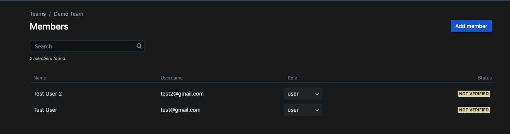
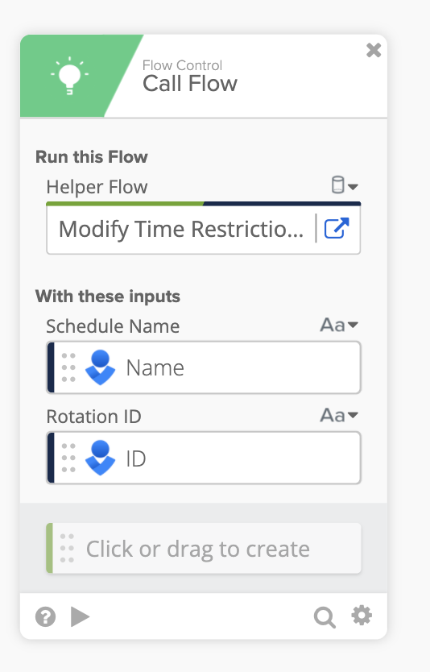
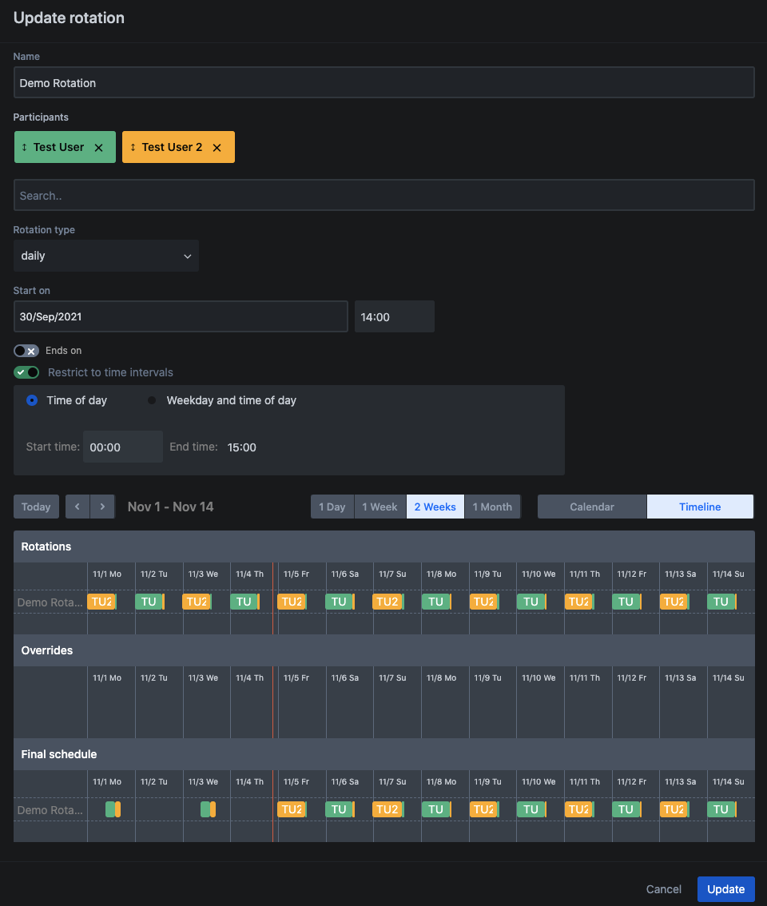

# Manage On-Call Rotations and Schedules with Opsgenie

## Overview

This template helps automate various frequently used tasks in OpsGenie
in relation to on-call rotations and scheduling.

## Prerequisites

Before you get started you will need:

* Log into your OpsGenie account

* In the Profile settings, make sure your account has the Admin role.

<!--  -->

* Navigate to Settings, click the "API Key Management" at the bottom left corner, then click "Add new API key". 

<!--  -->

* Provide a Name to the API key, and check all the boxes to make sure the key has full access.

<!--  -->

* Set up a new OpsGenie connection using this API key, you can create this connection from either the Connections tab, or from any OpsGenie card.

## Main Flow Instructions

Note: Always check the Note cards in each flow for additional
instructions.

### Flow One: Create Team/Add Team Member

This flow creates an OpsGenie Team, and adds Team Members for you.

#### **Required inputs:**

1\. Team Name

2\. Username (number based on how many users you want to add as team
member)

#### **Setup and Run:**

1\. You will see one Text.Compose card with \"Demo Team\" on it, replace
the \"Demo Team\" with the Team Name you want.

2\. You will see two Text.Compose cards with \"test@gmail.com\" and
\"test2@gmail.com\" on them, replace them with the Username of the users
you want to add as the team member.

Optional: We\'re just adding two users into the team in this template as
an example. In order to add more users, add extra Text.Compose cards at
the beginning of the flow based on your requirement (one for each
additional user), then add extra "Add Team Member" cards in the flow's
Step 2, follow the pattern of existing "Add Team Member" card, drag the
Team Name and Username fields into the card.

3\. Now based on your requirement, the next step varies:

-   If you just want to create a new Team and add Team members:  
Delete the "Call Flow" card in the flow's Step 3, Save the flow
and click "Test", the flow will accomplish the remaining for you.

-   If you want to create a new Schedule under this newly-created Team as well as a new Schedule Rotation under this Schedule:  
Save the flow and refer to the Extensibility section below.

#### **Extensibility**

As a parent flow:

This flow can be extended as the parent flow of another main flow
"Create Schedule/Rotation".

In this use case, this parent flow will run first, then it will take the
name of the Team just created in this flow and pass it into "Create
Schedule/Rotation" as input, and trigger the "Create Schedule/Rotation"
flow. The details of how to set up "Create Schedule/Rotation" will be
described in its own section below.\
We've built the "Call Flow" card and made the configuration for you at
the end of the flow, so you don't have to modify anything here.

You need to set up and save both flows before clicking "Test" on this
parent flow.

#### **Flow Example Output:**

New Team: Demo Team containing two team members\

## Flow Two: Create Schedule/Rotation

This flow creates a Schedule under a specific Team.

Then it creates a Rotation under this Schedule, and adds all the Team
members as participants in this Rotation.

Finally, it sends Email notification to all the participants under this
Rotation. (This part only works when the users' Email addresses are the
same as their Usernames in OpsGenie.)

#### **Required inputs:**

1\. Team Name (You don't have to provide this if you use this flow as a
child flow of "Create Team/Add Team Member" flow)

2\. Schedule name

3\. Rotation name

4\. Username (Only needed if you want to add individual users not
members of the Team into the Rotation as participants)

5\. Gmail account (You need a Gmail account in order to create a
connection on the "Send Email" card in the last step of the flow. All
notification emails sent to the Rotation participants will be sent from
this Gmail account.)

#### **Setup and Run:**

1\. You will see one Text.Compose card with \"Demo Schedule\" on it,
replace the \"Demo Schedule\" with the Schedule name you want.

2\. You will see one Text.Compose card with \"Demo Rotation\" on it,
replace the \"Demo Rotation\" with the Rotation name you want.

3\. Optional:
If you want to add individual users not members of the Team into the
Schedule Rotation of the Team, you can get rid of cards in flow Step 2
and 3, use the \"Build Participant Object\" card to build your own
participants (one card for each participant), then fill in the
Participants list in the "Create Schedule Rotation" card in flow Step 4,
make sure to use List.Construct cards to construct them into a List,
even there's only one participant.

Then Save the flow and move to the next step.

4\. Optional:

You will see that the Step 6 in the flow is optional, you can add a
"Call Flow" card here to call either "Modify Time Restrictions - Day and
Time" or "Modify Time Restrictions - Time Only" flow to update the Time
Restrictions in the Rotation you just created.\
If you want to utilize this option, ignore the next step and directly
refer to the Extensibility section - "As a parent flow" below.

5\. Now based on your requirement (not using the option above), the next
step varies:

-   If you want to run this flow separately, create a new Schedule under
     a specific team, and add all the team members of that team into
     the Rotation:  
     Save this flow and click "Test", manually type in the Team Name, and 
     click "Run Test".

-   If you want to use this flow as a child flow of "Create Team/Add
     Team Member" flow, and want to add all team members as
     participants of the new Rotation:  
     Save this flow and refer to the Extensibility section - "As a
     child flow" below.

#### **Extensibility**

As a child flow:

As mentioned above, this flow can be used as the child flow of "Create
Team/Add Team Member" flow.

In this use case, you don't have to manually click "Test" on this flow.
Once you set up and save both of the flows, click "Test" on "Create
Team/Add Team Member" and both flows will be executed.

As a parent flow:

As mentioned above, this flow can also be used as the parent flow of
either "Modify Time Restrictions - Day and Time" or "Modify Time
Restrictions - Time Only" flow.

In this use case, you have to manually add a "Call Flow" card at the end
of the flow, and click the "Choose Flow", navigate to the template
folder, choose either \"Modify Time Restrictions - Day and Time\" or
\"Modify Time Restrictions - Time Only\" flow. After choosing the flow,
you will see two fields "Schedule Name" and "Rotation ID" pop up. Then
you need to drag the corresponding fields from the previous "Create
Schedule" and "Create Schedule Rotation" cards here.

After this flow runs, it will take the Name of the Schedule and the ID
of the Rotation just created in this flow, pass them into "Create
Schedule/Rotation" as inputs, and trigger the \"Modify Time
Restrictions - Day and Time\" or \"Modify Time Restrictions - Time
Only\" flow based on your choice.

The details of how to set up \"Modify Time Restrictions - Day and Time\"
or \"Modify Time Restrictions - Time Only\" will be described in their
own sections below.

Now based on your requirement, the next step varies:

-   If you want to run this flow separately from "Create Team/Add Team Member":  
Set up and save both of this flow and the "Modify Time Restrictions"
flow you choose, click "Test" in this flow, manually type in the Team
Name, and click "Run Test".

-   If you're also using this flow as the child flow of "Create Team/Add
Team Member":  
Make sure all the three flows have been configured and saved properly,
then click "Test" in the "Create Team/Add Team Member" flow.

### **Flow Example Output:**

_New Schedule: Demo Schedule_

_New Rotation: Demo Rotation_

### 

### 

## Flow Three: Modify Time Restrictions - Time Only

This flow updates the \"Time of day\" time restriction in a specific
Rotation, and lets you verify the status after.

_"Time Only" == "Time of day" in UI_

Note: A Schedule Rotation can only have one time restriction if \"Time
Only\" restriction type is selected.

#### **Required inputs:**

1\. Schedule Name (You don't have to provide this if you use this flow
as a child flow of "Create Schedule/Rotation" flow)

2\. Rotation ID (You don't have to provide this if you use this flow as
a child flow of "Create Schedule/Rotation" flow)

#### **Setup and Run:**

1\. In flow Step 1, modify the "Build Time Restriction Object" card to
reflect the time restriction you want to update on the Rotation.

2\. Now based on your requirement, the next step varies:

-   If you want to run this flow separately, update the \"Time of day\" time restriction in a specific Rotation under a specific Schedule:  
Save this flow and click "Test", manually type in the Schedule Name
and Rotation ID, and click "Run Test".

-   If you want to use this flow as a child flow of "Create Schedule/Rotation" flow:  
Save this flow and refer to the Extensibility section - "As a
parent flow" section in Flow Two: Create Schedule/Rotation.

3\. Check the output of the Read Schedule Rotation card at the end of
the flow (or go to your OpsGenie dashboard) to verify if the time
restrictions have been updated correctly.

#### **Flow Example Output:**

  
## Flow Four: Modify Time Restrictions - Day and Time

This flow updates the \"Weekday and time of day\" time restriction in a
specific Rotation, and lets you verify the status after.

_"Day and Time" == "Weekday and time of day" in UI)_

Note: A Schedule Rotation can have multiple time restrictions configured
within a week if \"Day and Time\" restriction type is selected.

### **Required inputs:**

1\. Schedule Name (You don't have to provide this if you use this flow
as a child flow of "Create Schedule/Rotation" flow)

2\. Rotation ID (You don't have to provide this if you use this flow as
a child flow of "Create Schedule/Rotation" flow)

### **Setup and Run:**

1\. In flow Step 1, modify the "Build Time Restriction Object" cards to
reflect the time restriction you want to update on the Rotation. You can
add additional "Build Time Restriction Object" cards as needed.

2\. Now based on your requirement, the next step varies:

-   If you want to run this flow separately, update the \"Weekday and time of day\" time restriction in a specific Rotation under a specific Schedule:  
Save this flow and click "Test", manually type in the Schedule Name and Rotation ID, and click "Run Test".

-   If you want to use this flow as a child flow of "Create Schedule/Rotation" flow:  
    Save this flow and refer to the Extensibility section - "As a
    parent flow" section in Flow Two: Create Schedule/Rotation.

3\. Check the output of the Read Schedule Rotation card at the end of
the flow (or go to your OpsGenie dashboard) to verify if the time
restrictions have been updated correctly.

### **Flow Example Output:**

# Limitations & Known Issues

No existing issues found for these flows

For all other operations this template doesn't support, please check the
OpsGenie connector directly. We've provide plenty of cards to cover CRUD
actions for User, Team, Schedule and Rotation for you.

# Appendix

OpsGenie Official API documentation:\
https://docs.opsgenie.com/docs/api-overview
