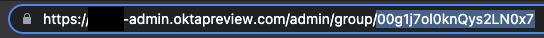

# Quarantine Users

## Overview

Taking action on compromised accounts helps increase the security posture of any organization. External systems like Splunk constantly analyze data, searching for specific patterns that could indicate a compromised account. If an account is identified, organizations could quarantine the account and prevent further access to critical applications.

When exposed as a webhook, this flow can be invoked by external systems and help with incident response efforts by quickly adding the user to a quarantine group associated with individual Application Sign-on policies to deny access to the application. At the end of the flow, Okta will clear the user session, forcing it to re-authenticate. It will now be limited to access only the applications that are not associated with the quarantined event.

Furthermore, organizations could notify the end-user, managers, or administrators through emails or messages to collaboration tools, such as Slack or Microsoft Teams.

## Before you get Started / Prerequisites

Before you get started, here are the things you’ll need:

- Access to an Okta tenant with Okta Workflows enabled for your org.
- An Okta group named "Quarantine".

## Setup Steps

Create the application sign-on policy.

1. Log in to your Okta admin dashboard (https://\<tenant>-admin.okta.com/admin/dashboard).
2. Expand Applications and click Applications.
3. Select the application you want to deny access to once the group is added to the quarantine group.
4. Click Sign On.
5. At Sign On Policy, click Add Rule.
6. Name your rule ("Quarantine", for example).
7. At Conditions \> PEOPLE select “The following groups and users:”, search for the Quarantine group that you created as part of the prerequisites.
8. At Actions \> ACCESS, “When all the conditions above are met, sign on to this application is:”, select Denied from the drop-down.
9. Click Save.
10. Make sure this new rule has 1st Priority over any other rule you might have for this application.
11. Repeat these steps for any additional application you want to deny access to.

Configure the flow

1. Log in to your Okta admin dashboard (https://\<tenant>-admin.okta.com/admin/dashboard).
2. Click Directory \> Groups, search for your Quarantine group.
3. Click your Quarantine group and copy the groupId from your address bar  .
4. Access Workflows.
5. Click "01\. Add.User.To.Quarantine.Group", at the Add User to Group card, replace the \<groupId> with the id that you copied on Step 3.

## Testing this Flow

1. Log in to your Okta admin dashboard (https://\<tenant>-admin.okta.com/admin/dashboard).
2. Access Workflows.
3. Click the folder where the template was created.
4. Click "01\. Add.User.To.Quarantine.Group".
5. Click "Test" and for the body use the following JSON: {“userEmail”:”\<your_testuser_login_information>”}.
6. Click Run Test.

Testing the flow outside of Okta

1. Click "01\. Add.User.To.Quarantine.Group".
2. At the bottom of the API Endpoint card click \</>.
3. Copy the Invoke URL, and use this information to invoke the flow in your third-party system.

## Limitations & Known Issues

- The "01\. Add.User.To.Quarantine.Group" flow is exposed as a webhook so that other systems can be invoked externally. Not all third-party systems offers the functionality to invoke webhooks, and the configuration steps will be different for each system.
- The "01\. Add.User.To.Quarantine.Group" flow expects a request body with “{“userEmail”:”\<login>”}. You might need to alter the expected attribute depending on what the third-party system can provide. Okta requires the Okta ID or username to search for the user, you might need to alter the flow if your third-party system cannot provide the necessary attributes.
<!--stackedit_data:
eyJoaXN0b3J5IjpbMTIyNzUwNjgxMyw4Nzk5MDgzNDQsLTE1MT
k4NDcyXX0=
-->
