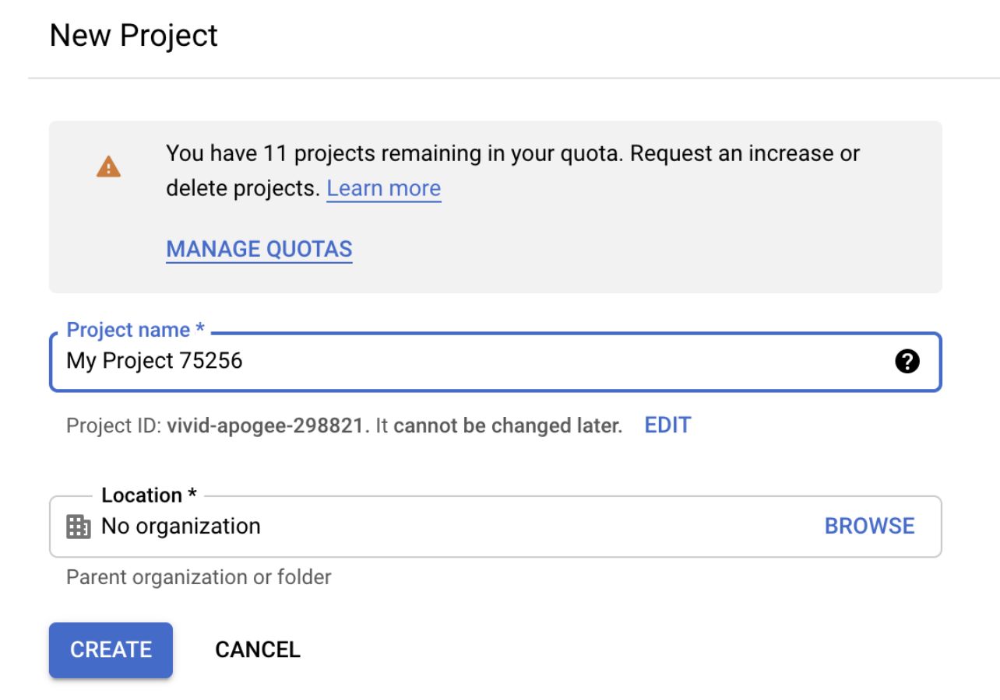
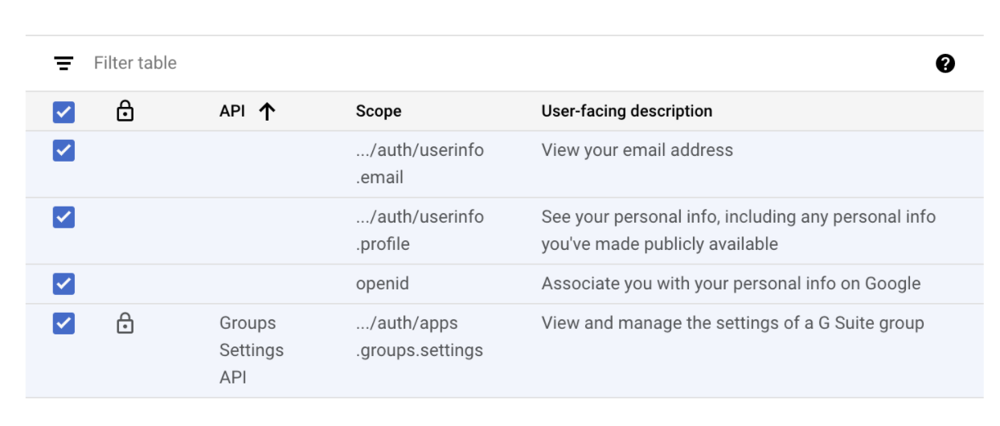
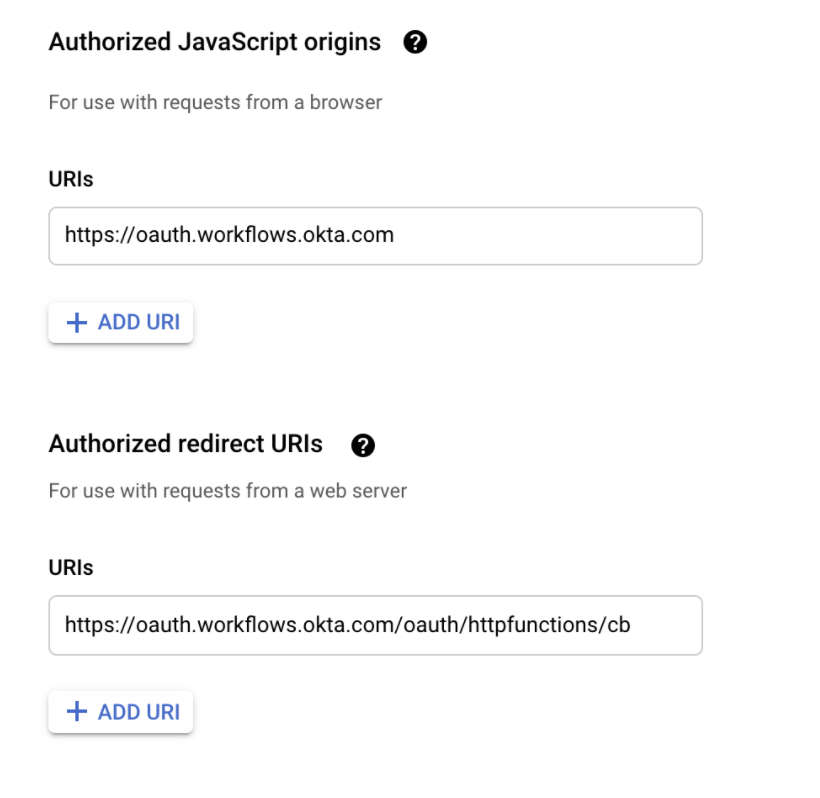

# Custom HTTP connector for GSuite Admin in Workflows

## Overview

Our current Workflows connector for G Suite Admin does not include all functions within Google Workspace APIs . The Custom API card is also restricted to the Directory and Licensing APIs. As our product team expands the scopes and permissions for different Workspace APIs, you can use this guide as a workaround to create your own custom HTTP connector to request for specific scopes from different Workspace APIs.

## Before you get Started/Prerequisites

Before you get started you will need:

*   Access to an Okta tenant with Okta Workflows enabled for your org
*   Access to a tenant for Google Workspace

## Workflow Setup Steps

1. Navigate to[ https://console.developers.google.com/](https://console.developers.google.com/) and login with the G Suite Admin login.
2. If you do not already have a project, create a new project, leave the rest to defaults and click on Create:

3. Search for the APIs in the main Search Window, for example - Group Settings API and enable it for the project. This is done to include API specific scopes to the authorized application (Okta Workflows).
4. While making sure you’re in the project you just created, click on “OAuth Consent Screen” under APIs and Services. Click on “Internal” to use the API for internal apps and click on Create.
5. Enter a name for the application and you can choose the admin credentials as the Support email address. Under ‘Authorized domains’ enter '[okta.com](http://okta.com/)' and type in your email for Developer Contact Information.
6. Under Scopes, choose all the Scopes you require for your Workflow and click on update.

7. Leave the rest to defaults and finish the process.
8. Click on ‘Credentials’ under APIs and Services > Create credentials > OAuth Client ID. Enter a name and the following information for Authorized Origins and Redirect URIs. Copy the client ID and secret from this screen to enter on the Okta side. Hit on Save.

   **URIs:** https://oauth.workflows.okta.com
   
   **Authorized redirect URIs:** https://oauth.workflows.okta.com/oauth/httpfunctions/cb

9. Open the Workflows Console in Okta and click on Connections. Create a new HTTP connection with the following values:
    1. Choose OAuth as the authentication method.
    2. Authorize path:[ https://accounts.google.com/o/oauth2/auth](https://accounts.google.com/o/oauth2auth)
    3. Token Path:[ https://accounts.google.com/o/oauth2/token](https://accounts.google.com/o/oauth2/token)
    4. Scopes:[ https://www.googleapis.com/auth/apps.groups.settings](https://www.googleapis.com/auth/apps.groups.settings) (as an example - separate multiple scopes with a space)
    5. Client ID : copied from the previous step
    6. Client Secret : copied from the previous step
10. Click on Create, authorize the request with the admin G Suite credentials and you’re set to directly call Google Workspace’s APIs and perform actions based on the scopes requested.

## Testing this flow

*   Ensure that the flow is turned on.
*   Choose the new connector created in the HTTP card in the flow
*   Click on test for that specific card and give the API endpoint you’re calling to test
*   Verify the results on the right screen 

## Limitations & Known Issues 

*   Keep in mind the [Okta Workflows System Limits](https://help.okta.com/en/prod/Content/Topics/Workflows/workflows-system-limits.htm).
*   When invoking HTTP endpoints consider any applicable rate limits of the SaaS application (or http endpoint) that you are invoking. You should almost always set up error handling on the card to retry periodically.
