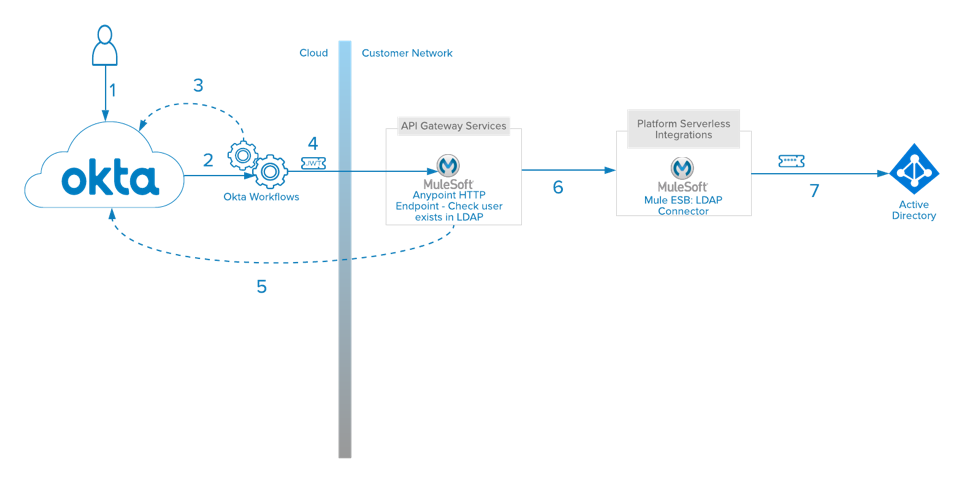
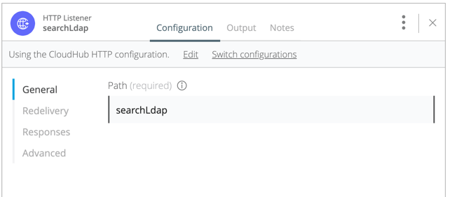
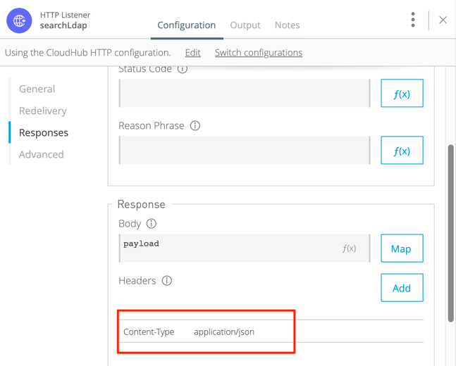
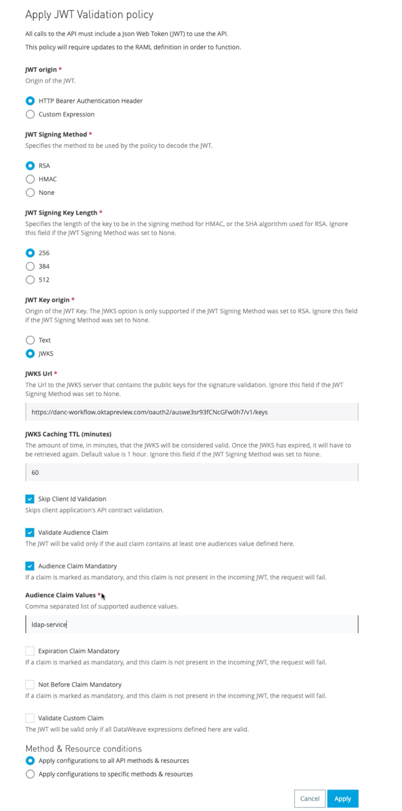

# Reference an on-premise LDAP repository using Mulesoft Technologies

## Overview
It's common for identity lifecycle processes to require advanced calculations when managing user profiles—including calculations that involve data not present immediately within the identity platform itself. Examples include calculating unique usernames/email addresses and determining proper mailstop values. This template is an example of referring to an LDAP repository to perform a generic search within Okta Workflows.  It can be modified and applied to any sort of repository such as a SQL database.

This example leverages the Mulesoft Anypoint platform to host the API endpoint consumed by Okta Workflows.

 

Flow:
- A user’s identity is maintained in the identity source of record.
- A lifecycle event in Okta triggers a workflow to execute.
- The workflow obtains a valid OAuth2 access token from Okta to execute the API.
- The workflow invokes the configured HTTP endpoint on MuleSoft Anypoint to execute the search. The access token issued by Okta is included to authorize the transaction.
- The Anypoint platform validates the access token.
- The configured Mule flow is invoked to execute the LDAP search.
- The LDAP search results are obtained by the Mule flow, and returned to Okta Workflows.

## Prerequisites
Here are the things you’ll need:
1. Access to an Okta tenant with Okta Workflows enabled for your org.
2. Access to an Okta tenant with API Access Management (AM) enabled (can be the same as the Workflows org).
3. Access to an Anypoint platform tenant to create the appropriate endpoints.
4. An on-premises server that will host the Anypoint [Runtime Manager Agent](https://docs.mulesoft.com/runtime-manager/runtime-manager-agent). This server will be where the LDAP calls are made from. We’ll be using the UI on the server, so these instructions assume that you are using a Windows server.
5. Service account credentials to the LDAP repository that you wish to query.

## Setup Steps
The setup process can be divived into three parts:
- Okta Tenant Setup
- Mulesoft Anypoint Platform Setup
- Okta Workflow Setup

### Okta Tenant Setup
There are a few components that must be setup within the Okta tenant in order to support this integration:
1. A service identity that will be authenticated as when minting a token.
2. An OAuth2 client that will be used when authorizing to the authorization server.
3. An Okta OAuth2 authorization server.

#### Okta: Set up the Service Account
In Okta create a new user that will be used by Okta Workflows to obtain an OAuth2 token.

**Note: While any user Okta can be used for this, the best practice is to use an Okta  account that's not associated with a person.**

Create a user as shown.

#### Okta: Set up the OAuth2 Client

In the Okta tenant add an application, as follows:

You must provide an application name and a login redirect URI for the OIDC details.

Enter a name for the application in **Application name:** 

For the value of the **Login Redirect URI** field enter one of the following: 
- https://oauth.workflows.oktapreview.com/oauth/httpfunctions/cb (non-production)
- https://oauth.workflows.okta.com/oauth/httpfunctions/cb (production)

After the application is created, you’ll be brought to an application configuration screen.  In the General Settings tab, make the following 2 changes:

**Allowed Grant Types:** Select the Refresh Token and Authorization Code check boxes.

**User Consent:** Deselect the Require consent check box

#### Okta: Assign the Non-personal Identity to the application:
Click the Assign button to assign the user that you created in the previous step to the application.

### Okta: Set up the Okta Authorization Server
In Okta’s Authorization Server screen, click Add Authorization Server.

Enter a name and audience  for your authorization server. Make a note of your audience value.

Create a new scope with the name: api:read that will be requested by Okta Workflows:
 

Create a new authorization policy that will allow Okta Workflows to request the following two scopes:
* api:read
* offline_access (refresh tokens)

When you create the policy, ensure that you select the application that you created.

Add a rule to the policy.

Selecting both the 'api:read' and 'offline_access' scopes.

### Mulesoft Anypoint Platform Setup

This section outlines how to configure the necessary components in the Anypoint platform to achieve this integration:
1. A server running the Runtime Manager Agent
2. A Mule flow that contains the LDAP connector, deployed to the server
3. A proxy endpoint used to expose the Mule flow in a secure manner
4. A valid OAuth2/OIDC integration

#### Mulesoft: Install the Runtime Manager Agent
Download the Mulesoft Runtime to the server:
https://docs.mulesoft.com/mule-runtime/4.2/runtime-installation-task

In the Anypoint platform, add a new server to the Runtime Manager as shown:

The Anypoint Platform will give you a specialized command to run on the server. In the '/bin' directory of the Mulesoft runtime, execute the “amc_setup” command that the platform gave you.

After that step is done, execute the following commands to install the Mulesoft platform as a Windows service:

`/bin/mule.bat install`

`/bin/mule.bat start`

When the commands finish executing, a service should appear in the Runtime Manager with the status "Running". 

#### Mulesoft: Configure the Mule Flow
The Mule flow is the component that will be deployed to the on-premises server, and speaks to the LDAP endpoint.

In Anypoint, go to the Design Center. Click Create new button and then click “Create new application”.

Enter name for your app and then set up the application trigger as follows:

Click Next.

Setup the application target as follows:

Click Done.

After you finish the creation wizard, you’ll be presented with the configuration for the inbound HTTP listener for the application.

Enter a relative path for the HTTP endpoint as shown:

In the Responses tab, click Add in the Headers section to add a header with `Content-Type =  application/json` to indicate to Okta Workflows that the information passed back is in JSON format:

Close the dialog.

Click the LDAP card in the flow, and configure it as follows:

**Base DN:** Enter the OU you wish to limit your search to, in DN format.

**Filter:** Enter `#[attributes.queryParams.q]` to indicate that we wish to use the querystring variable “q” to specify our query.

**Attributes:** Configure whatever LDAP attributes you wish to retrieve from the directory.

**Scope:** Use Sub Tree.

Click the create LDAP configuration link to create a new LDAP configuration. This is where the credentials and directory host information should be set up.

**Note: the actual values do not matter at this time, they will be configured properly when the application is deployed to the server.**

Click Save.

Next we need to add a new transform to the flow, this takes the values from the LDAP entry objects returned from the LDAP connector and outputs JSON that we can parse on the Okta side.

Close the LDAP connector configuration card.

Click “+” to add a new transform object:

When you add the new transform object, you’ll be presented with a configuration screen as shown.  The quickest way to configure this is to switch to the “script” view, and enter the payload map from the following example. In this example, the values from the LDAP directory are on the right:

`payload map(item, index) -> {
    FirstName: item.givenName,
    LastName: item.sn,
    upn: item.userPrincipalName,
    samaccountname: item.sAMAccountName
}`

You can add any additional fields that you configured on the LDAP card.

Close the Transform card.

You've finished creating your Mule app which you can now export for deployment. To do this, click Export in the top right corner of the Design Center.

Select Export mule application. This option saves a *.jar file to your desktop. Click Export.

#### Mulesoft: Deploy the Application to your On-Premise Server
We need to deploy the application to your server that you onboarded in the first section of this guide.

Open the Runtime Manager and click Deploy Application:

Enter a name for your application and select the *.jar file exported from Designer Center as your deployment target.

Go to the Properties tab, and enter your LDAP connection information:
- **ldap.Connection.url.value**: The LDAP server's host information.
- **ldap.Connection.authPassword.value**: The password to use to authenticate to the directory.
- **ldap.Connection.authDn.value**: The service account credential to use to authenticate to the directory.
- **cloudhub_http.Connection.host.value**: 1
- **cloudhub_http.Connection.port.value**: 8084 (The local HTTP endpoint will be hosted here).

**Note: this HTTP endpoint will not be internet accessible. It will be exposed using a proxy that we’ll set up next.**

Click Deploy Application.

Your LDAP endpoint is now ready for use.

#### Mulesoft: Set up the Secure Proxy
To securely expose the Mule endpoint to Okta, we need to create a publicly accessible proxy endpoint that will perform OAuth2 authentication with Okta.

Go into the API Manager section of the Anypoint platform, and create a new API:

Select HTTP API as the type of the API.

Click Continue.

Set up the API as shown.

**Note: for the “Implementation URI”, you’ll put the private host/port of the machine running the MuleSoft runtime agent. If you did not use 8084 for your cloudhub.Connection.port (or even host) parameters, you must change the implementation URI accordingly.**

Next we apply a JWT validation policy so that proper OAuth2 validation is required to call the API. Add the policy as shown:

When configuring the policy, there are 2 fields that are specific to the Okta authorization server you created earlier in this guide:
- **Audience Claim:** This must be the audience value from your authorization server.
- **JWKS Url:** This is the “keys_endpoint” metadata that can be found in the OAuth2 well-known metadata endpoint (highlighted in the screenshot).

You can now deploy your API.

Click Settings.

**Note that requests will not yet be allowed because we have not properly configured our OAuth2 authorization server in Okta.**

### Okta Workflow Setup

Now that the complete environment is set up, let’s ensure the workflow has the correct API gateway endpoint configured within it.

There are 3 steps necessary to completing the workflow configuration.

1. Create a new HTTP endpoint in Okta Workflows that will store the OAuth2 tokens for use in calling the LDAP gateway service. Use the following configuration:
    * **Authentication Type**: OAuth2

    * **Authorize Path**: Enter your authorization server's /authorize endpoint.

    * **Token Path**: Enter your authorization server's / token endpoint.

    * **Scope**: **api:read offline_access**

    * **Client ID**: Use the client ID of the app you created during your Okta setup.

    * **Client Secret**: Use the client secret of the app you created in the Okta setup.  

    When you finish, Okta will ask you to sign in. Sign in using the non-personal credentials you created during the Okta setup.

2. Update the gateway URL card with the appropriate URL you obtained at the end of the API setup section.

3. Update the HTTP card to use the new connection you just created in step 1.

## Testing these flows

This flow is intended to be executed as part of a higher level parent workflow.  It takes a single parameter, ldapFilter, and its response is a JSON array of elements found in the LDAP directory.  There is no limit to the objects returned other than the LDAP query passed in.

Inputs: ldapFilter - when you invoke the workflow, enter a valid LDAP query string.
Output: JSON array of LDAP entries.
