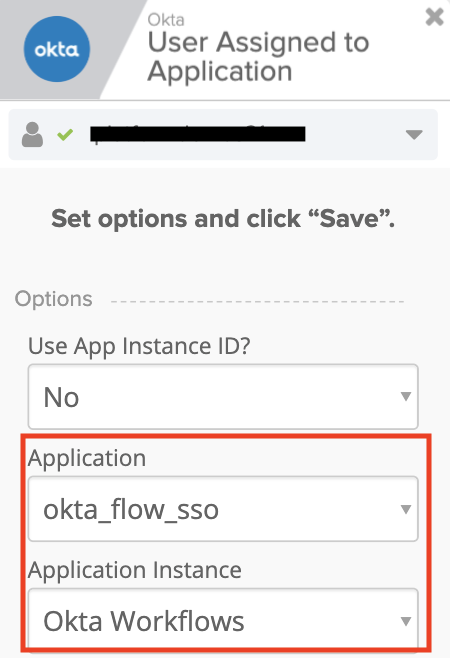
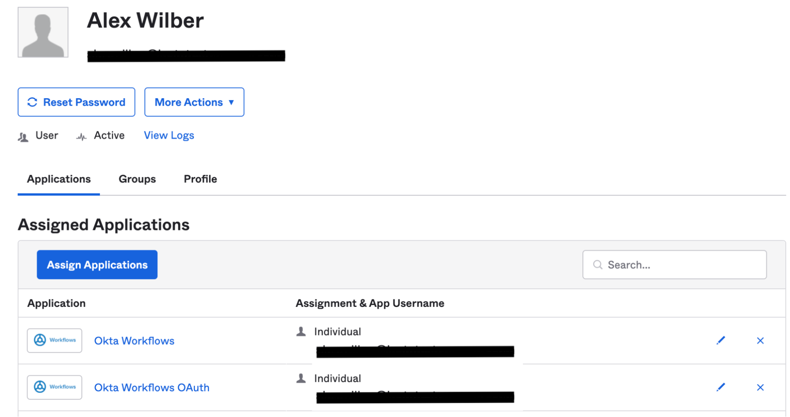
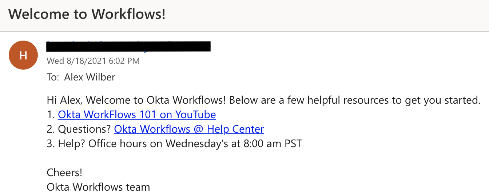

# Send a Welcome Email to New User of an Application

## Overview

A welcome email is the first impression that an organization makes on a new customer or employee. Welcome emails can deliver a special promotion code, provide information to enhance the user experience, or just send a friendly hello. This template demonstrates how a welcome email can be sent automatically to a new user.

## Prerequisites

1.  Access to an Okta tenant with Okta Workflows
    enabled
2.  A configured Okta Connection. To configure a connection, see [Authentication](https://help.okta.com/wf/en-us/Content/Topics/Workflows/connector-reference/okta/overviews/authorization.htm).
3.  A configured Gmail connection. To configure a Gmail connection, see [Authentication](https://help.okta.com/wf/en-us/Content/Topics/Workflows/connector-reference/gmail/overviews/authorization.htm).

## Setup

In this template, a welcome email is automatically sent
out to users who gain access to Okta Workflows.This template can be modified to
meet your business needs.

1.  Send a welcome email to Okta Workflow users: Set
    **Options** on the User Assigned to Application card to Okta Workflows
    by selecting the following:  
    - Application: `okta\_flow\_sso`  
    - Application Instance: `Okta Workflows`

2. Click **Save**.

  

3.  Check your Gmail connection in the Gmail Send Email
    card.
3.  Click **Save** to save the flow.
4.  Toggle the **Flow is OFF** switch to **Flow is ON**.

## Test

1.  Add an employee to Application Okta Workflows. Flow is automatically triggered.  
    

2.  Check Flow History.
3.  The employee automatically receives a welcome email.  
    

        

## Limitations & Known Issues

-   The screenshots in this readme file may
    change over time. If they do, recognize that there may be changes, but focus on the key terms and proceed as best you can. 
-   Keep in mind the Okta Workflows [System Limits](https://help.okta.com/wf/en-us/Content/Topics/Workflows/workflows-system-limits.htm).
-   Error handling is not addressed in this template.
    

