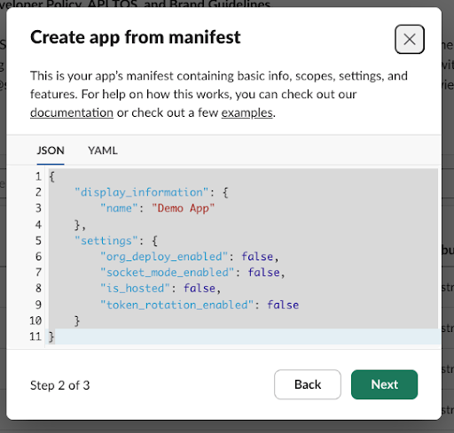

# Slack App Template Project
## Overview
Using Slack Apps with Okta Workflows processing allows an easy to prep no-code/low-code interface with nearly unlimited possibilities. Once the basic functionality is built, the opportunities for growth and further development are endless.
## Setup Steps
1. [Create a Slack app](#create-a-slack-app).
2. [Create Slack app connector](#create-a-slack-app-connector)
3. [Create flows for your Slack app connector](#build-slack-api-connectors-for-your-app).
4. [Import the Okta Workflows project](#import-the-okta-workflows-project). 
## Create a Slack App
Okta recommends downloading and editing the provided app manifest JSON file.
1. Download the app manifest JSON file and changes names, descriptions, command triggers, and URLs. Save your changes.
    * If you don't have valid URLs at this stage, you may need to modify them inside Slack later.
2. Go to [https://api.slack.com/apps](https://api.slack.com/apps) and click **Create New App**.
3. Select your workspace. 
3. Select **From a manifest** and copy and paste the contents of the app manifest JSON file. 
    * If you aren't using the manifest, select **From scratch**. 

4. Click **Next** and then click **Create**.  
5. Modify the app settings as needed and then save and deploy the app.
6. Go to **OAuth Permissions** and obtain your **Bot User OAuth Token**. 

## Create connectors
Create connectors for your Slack app in Connector Builder. See [Create a connector](https://help.okta.com/wf/en-us/content/topics/workflows/connector-builder/create-new-connector.htm). 

* [Create a Slack app connector](#create-slack-app-connector).
* [Create a connection](#create-connection).
* [Create an API connector](#create-api-connector).
### Create a Slack app connector
1. In Connector Builder, click **New Connector**.
2. Enter a name for the connector, such as `Custom Slack App Connector`.
3. Click **Save**.
4. Click **Set up authentication**.
5. Select **Custom** from the **Auth Type** dropdown menu.
6. Click **Add Parameter** and use the following settings:
    * **Label**: Bot Token
    * **Key**: bot_token
    * **Type**: Text
5. Click **Save**.

6. Click the **Test Connections** tab and click **New Connection**. 
7. Enter a name and description for the connection, and paste the **Bot User OAuth Token** from your Slack app. 
8. Click **Create**.
9. Add flows to your connector. See [Create flows for your Slack connector](#create-flows-for-your-slack-connector).
10. Click the **Deployment** tab. 
2. Click **Create test version** and then click **Deploy**.

### Create connection
1. Click the **Connections** tab from the Workflows console. 
2. Click **New Connection** and select your custom Slack app connector. 
3. Enter a name and description for the connection, and paste the **Bot User OAuth Token** from your Slack app.

### Create API connector
1. Click the **Connections** tab from the Workflows console. 
2. Click **New Connection** and select **API Connector**. 
3. Enter a name and description for the connection and enter the following settings: 
    * **Auth Type**: Custom
    * **Header Name**: bot_token
    * **Header Value**: Paste the **Bot User OAuth Token** from your Slack app.
4. Click **Create**. 

## Create flows for your Slack connector
Create flows to use in the Slack connector.

Create the following flows:
1. [Build httpHelper flow](#httphelper-flow) (required). 
2. [Build _authping flow](#build-_authping-flow) (required).
3. [Build Open a View flow](#build-open-a-view-flow). 
4. [Build Update a View flow](#build-update-a-view-flow). 
5. [Build Post a Message flow](#build-a-post-a-message-flow). 
## Build httpHelper Flow
Build an **httpHelper** flow with the following cards: 

Trigger: On Demand Helper Flow

#### Inputs
| Field | Type |
| ---| --- |
| **relative_url** | text |
| **request_method** |  text |
| **query**| object |
| **headers** | object |
| **body** | object |
#### Auth
| Field | Type |
| ---| --- |
| **Connection** | object |
| **Bot Token** | text |

Text - Concatenate

#### Inputs
| Field | Type | Input |
| ---| --- | --- |
| **text 1** | text | "Bearer " |
| **text 2** | text | Drag the value of the **Bot Token** from the **On Demand Helper Flow** card.

**Note**: The space at the end of "Bearer " is required. 

#### Outputs
| Field | Type |
| ---| --- |
| **Bearer Token** | text |

Object - Construct

#### Inputs
| Field | Type | Input |
| ---| --- | --- |
| **Authorization** | text | Drag the value of the **Bearer Token** from the previous card. |

#### Outputs
| Field | Type |
| ---| --- |
| header| object |

Object - Merge

#### Inputs
| Field | Type | Input |
| ---| --- | --- |
| **object 1** | object | Drag the **header** object from the previous card. |
| **object 2** | object | Drag the **headers** object from the **On Demand Helper Flow** card. |

#### Outputs
| Field | Type |
| ---| --- |
| merged_header| object |

Text - Concatenate

#### Inputs
| Field | Type | Input |
| ---| --- | --- |
| **text 1** | text | The API URL for your Slack app (such as https://slack.com/api/) |
| **text 2** | text | Drag the **relative_url** variable from the **On Demand Helper Flow** card. |

#### Outputs
| Field | Type |
| ---| --- |
| URL| text |

HTTP - Raw Request

#### Inputs
| Field | Type | Input |
| ---| --- | --- |
| **url** | text | Drag the **relative_url** variable from the **On Demand Helper Flow** card. |
| **method** | - | Drag the **relative_method** variable from the **On Demand Helper Flow** card. |
| **headers** | object | Drag the **merged_header** output from the **Object - Merge** card. |
| **query** | object | Drag the **query** variable from the **On Demand Helper Flow** card. |
| **body** | object | Drag the **body** variable from the **On Demand Helper Flow** card. |

#### Outputs
Don't change the default output. 

Flow Control - Return

#### Inputs
| Field | Type | Input |
| ---| --- | --- |
| **statusCode** | number | Drag the **statusCode** output from the **HTTP - Raw Request** card. |
| **headers** | object | Drag the **headers** output from the **HTTP - Raw Request** card. |
| **body** | text | Drag the **body** output from the **HTTP - Raw Request** card. |

#### Outputs
N/A

 

Save and enable the flow. Set it to save data. 

See [Build an httpHelper flow](https://help.okta.com/wf/en-us/content/topics/workflows/connector-builder/capia-httphelper.htm).

## Build _authping Flow
Build an **_authping** flow with the following cards: 

Trigger: On Demand - Connector Authping

#### Auth
| Field | Type |
| ---| --- |
| **Connection** | object |
| **Bot Token** | text |

 If/Error (Try) function

#### Inputs

 Text - Concatenate 

#### Inputs
| Field | Type | Input |
| ---| --- | --- |
| **text 1** | text | "Bearer " |
| **text 2** | text | Drag the value of the **Bot Token** from the **On Demand Connector Authping** card.

**Note**: The space at the end of "Bearer " is required. 

#### Outputs
| Field | Type |
| ---| --- |
| **Bearer Token**| text |

Object - Construct

#### Inputs
| Field | Type | Input |
| ---| --- | --- |
| **Authorization** | text | Drag the **Bearer Token** output from the previous card. |

#### Outputs
| Field | Type |
| ---| --- |
| **Headers**| object |

HTTP - Raw Request

#### Inputs
| Field | Type | Input |
| ---| --- | --- |
| **url** | text | The API URL for your Slack app (such as https://slack.com/api/auth.test). |
| **method** | - | `POST` |
| **headers** | object | Drag the **Headers** output variable from the **Object - Construct** card. |
| **query** | object | Leave as the default. |
| **body** | object | Leave empty. |

#### Outputs
Don't change the default output. 

#### Outputs
| Field | Type | Output |
| ---| --- | --- |
| **status_code** | number | Drag the **statusCode** output from the **HTTP Raw Request** card. |
| **message** | text | Drag the **body** output from the **HTTP Raw Request** card, and the **message** of the if error. |
| **respponseBody** | text | Drag the **body** output from the **HTTP Raw Request** card. |

True/False - Compare

#### Inputs
| Field | Type | Input |
| ---| --- | --- |
| **value a** | number | Drag the **status_code** output from the **Try** function outputs. |
| **comparison** | - | `equal to` |
| **value b** | number | `200` |

#### Outputs
| Field | Type |
| ---| --- |
| **working**| boolean |

Object - Construct 

#### Inputs 
| Field | Type | Input |
| ---| --- | --- |
| **status_code** | number | Drag the **status_code** output from the **Try** function outputs. |
| **message** | text | Drag the **message** output from the **Try** function outputs. |
| **responseBody** | text | Drag the **responseBody** output from the **Try** function outputs. |

#### Outputs
| Field | Type |
| ---| --- |
| **serviceResponse**| object |

Flow Control - Return Status

#### Inputs
| Field | Type | Input |
| ---| --- | --- |
| **working** | boolean | Drag the **working** output from the **True/False - Compare** card. |
| **serviceResponse** | object | Drag the **serviceResponse** output object from the previous card. |

#### Outputs
N/A

 
Save and enable the flow. Set it to save data. 

See [Build an _authping flow](https://help.okta.com/wf/en-us/content/topics/workflows/connector-builder/capia-authping.htm).

## Build Open a View Flow
Build an **Open a View** flow with the following cards: 

 Trigger: On Demand - Connector Action

#### Auth
| Field | Type |
| ---| --- |
| **Connection** | object |
| **Bot Token** | text |

#### Inputs
Create a **Static Input Group** named **Inputs** with the following settings:
| Field | Type |
| ---| --- |
| **View** | text |
| **trigger_id** | text |

See [https://api.slack.com/methods/views.open](https://api.slack.com/methods/views.open).

 Text - Compose

#### Inputs
| Field | Type | Input |
| ---| --- | --- |
| **compose** | text | https://slack.com/api/views.open |

#### Outputs
| Field | Type |
| ---| --- |
| **URL** | text |

 Object - Construct

#### Inputs
| Field | Type | Input |
| ---| --- | --- |
| **trigger_id** | text | Drag the value of **trigger_id** from the **On Demand - Connector Action** card. |
| **view** | text | Drag the value of **view** from the **On Demand - Connector Action** card. |

#### Outputs
| Field | Type |
| ---| --- |
| **Request Body** | object |

 Text - Concatenate

#### Inputs
| Field | Type | Input |
| ---| --- | --- |
| **text 1** | text | "Bearer " |
| **text 2** | text | Drag the value of the **Bot Token** from the **On Demand - Connector Action** card. |

**Note**: The space at the end of "Bearer " is required. 

#### Outputs
| Field | Type |
| ---| --- |
| **Bearer Token** | text |

 Object - Construct

#### Inputs
| Field | Type | Input |
| ---| --- | --- |
| **Authorization** | text | Drag the **Bearer Token** output from the previous card. |
| **Content-Type** | text | `application/json`  |

#### Outputs
| Field | Type |
| ---| --- |
| **Headers** | object |

 HTTP - Raw Request

#### Inputs
| Field | Type | Input |
| ---| --- | --- |
| **url** | text | Drag the **URL** output variable from the **Text - Compose** card. |
| **method** | - | `POST`  |
| **headers** | object | Drag the **Headers** output variable from the applicable **Object - Construct** card.   |
| **query** | object | Drag the **Request Body** output variable from the applicable **Object - Construct** card.   |
| **body** | object | Drag the **Request Body** output variable from the applicable **Object - Construct** card.   |

#### Outputs
Don't change the default output. 

 Flow Control - Return Outputs

#### Outputs
Create a **Static Output Group** named **Outputs** with the following settings:
| Field | Type |Output |
| ---| --- | --- |
| **Response** | text | Drag the **body** output from the **HTTP - Raw Request** card. |
| **Request Headers** | text | Drag the **headers** output from the **HTTP - Raw Request** card. |
| **Request Body** | text | Drag the **Request Body** output from the applicable **Object - Construct** card. |

 
Save and enable the flow. Set it to save data. 

See [Build a custom API action card](https://help.okta.com/wf/en-us/content/topics/workflows/connector-builder/capia-capia-card.htm).

## Build Update a View Flow
Build an **Update a View** flow with the following cards: 

 Trigger: On Demand - Connector Action

#### Auth
| Field | Type |
| ---| --- |
| **Connection** | object |
| **Bot Token** | text |

#### Inputs
| Field | Type |
| ---| --- |
| **Request Object** | object |

See [https://api.slack.com/methods/views.update](https://api.slack.com/methods/views.update).

 Text - Compose

#### Inputs
| Field | Type | Input |
| ---| --- | --- |
| **compose** | text | https://slack.com/api/views.update |

#### Outputs
| Field | Type |
| ---| --- |
| **URL** | text |

 Text - Concatenate

#### Inputs
| Field | Type | Input |
| ---| --- | --- |
| **text 1** | text | "Bearer " |
| **text 2** | text | Drag the value of the **Bot Token** from the **On Demand - Connector Action** card. |

**Note**: The space at the end of "Bearer " is required. 

#### Outputs
| Field | Type |
| ---| --- |
| **Bearer Token** | text |

 Object - Construct

#### Inputs
| Field | Type | Input |
| ---| --- | --- |
| **Authorization** | text | Drag the **Bearer Token** from the previous card. |
| **Content-Type** | value | `application:json` |

#### Outputs
| Field | Type |
| ---| --- |
| **Headers** | object |

 HTTP - Raw Request

#### Inputs
| Field | Type | Input |
| ---| --- | --- |
| **url** | text | Drag the **URL** output variable from the **Text - Compose** card. |
| **method** | - | `POST`  |
| **headers** | object | Drag the **Headers** output variable from the **Object - Construct** card.   |
| **query** | object | Drag the **Request Object** variable from the inputs of the **On Demand - Connector Action** card.   |

#### Outputs
Don't change the default output. 

 Flow Control - Return Outputs

Create a **Static Output Group** named **Outputs** with the following settings:
| Label | Field Type | Data Type |
| ---| --- | --- |
| **Response** | Text Field | Text |
#### Outputs
| Field | Type | Output |
| ---| --- | --- |
| **Response** | text | Drag the **body** output from the **HTTP - Raw Request** 

 
Save and enable the flow. Set it to save data. 

See [Build a custom API action card](https://help.okta.com/wf/en-us/content/topics/workflows/connector-builder/capia-capia-card.htm).

## Build a Post a Message Flow
Build a **Post a Message** flow with the following cards: 

 Trigger: On Demand - Connector Action

#### Auth
| Field | Type |
| ---| --- |
| **Connection** | object |
| **Bot Token** | text |

Create a **Static Option Group** named **Options** with the following settings:
| Label | Field Type |Data Type | Required
| ---| --- | --- | --- |
| **Message Type** | Dropdown | Text | Yes |

Set dropdown values to the following: 
| Option | Value |
| --- | --- |
| Message | send_message |
| Ephimeral | send_ephemeral |

#### Inputs
| Field | Type |
| ---| --- |
| **Channel ID** | text | 
| **User ID** | text | 
| **Text** | text | 
| **Blocks** | text | 

#### Outputs
Create a **Static Output Group** named **Output** with the following settings:
| Label | Field Type | Data Type |
| ---| --- | --- |
| **Status Code** | Text Field | Number |
| **Response Body** | Text Field | Text |

 Branching Lookup

#### Options
| When Value is | Then Result is
| --- | --- |
| send_message | https://slack.com/api/chat.postMessage |
| send_ephemeral | https://slack.com/api/chat.postEphemeral |

#### Outputs
| Field | Type |
| ---| --- |
| **URL** | text | 

 Text - Concatenate 

#### Inputs
| Field | Type | Input |
| ---| --- | --- |
| **text 1** | text | "Bearer " |
| **text 2** | text | Drag the value of the **Bot Token** from the **On Demand - Connector Action** card.

**Note**: The space at the end of "Bearer " is required. 

 Branching If/Else Function

Create a parent **If/Else** function card, with the following settings: 
| value a | comparison | value b |
| ---| --- | --- |
| Drag the **Message Type** output from **On Demand - Connector Action card**. | equals | send_ephemeral |

The **If/Else** function contains nested **If/Else** functions. 
#### Inputs

**If True**

Object - Construct

#### Inputs
| Field | Type | Input |
| ---| --- | --- |
| **channel** | text | Drag the **Channel ID** variable from the **On Demand - Connector Action card**. |
| **text** | text | Drag the **Text** variable from the **On Demand - Connector Action card**. |
| **text** | text | Drag the **User ID** variable from the **On Demand - Connector Action card**. |

#### Outputs
| Field | Type |
| ---| --- |
| **Body** | object | 

If/Else (child)

Create a child **If/Else** function card with the following settings: 
| value a | comparison | value b |
| ---| --- | --- |
| Drag the **Blocks** output from **On Demand - Connector Action card**. | isn't empty | N/A
#### Inputs

**If True**

Object - Construct

#### Inputs
| Field | Type | Input |
| ---| --- | --- |
| **Object** | text | Drag the **Body** variable from the previous **Object - Construct** card output. |
| **path** | text | Input the text "blocks". |
| **value** | text | Drag the **Blocks** variable from the **On Demand - Connector Action** card. |

#### Outputs
| Field | Type |
| ---| --- |
| **Body** | object | 

 

**If False**

Object - Construct

#### Inputs
| Field | Type | Input |
| ---| --- | --- |
| **Object** | text | Drag the **Body** variable from the previous **Object - Construct** card output. |
| **path** | text | Input the text "text". |
| **value** | text | Drag the **Text** variable from the **On Demand - Connector Action** card. |

#### Outputs
| Field | Type |
| ---| --- |
| **Body** | object | 

#### Outputs
| Field | Type | Output |
| ---| --- | --- |
| **Body** | object | Drag the **Body** output of both outcomes of the child **If/Else** functions. |

 

**If False**

Object - Construct

#### Inputs
| Field | Type | Input |
| ---| --- | --- |
| **channel** | text | Drag the **Channel ID** variable from the **On Demand - Connector Action card**. |
| **text** | text | Drag the **Text** variable from the **On Demand - Connector Action card**. |

#### Outputs
| Field | Type | 
| ---| --- | 
| **Body** | object |

If/Else (child)

Create a child **If/Else** function card with the following settings: 
| value a | comparison | value b |
| ---| --- | --- |
| Drag the **Blocks** output from **On Demand - Connector Action card**. | isn't empty | N/A
#### Inputs

**If True**

Object - Construct

#### Inputs
| Field | Type | Input |
| ---| --- | --- |
| **Object** | text | Drag the **Body** variable from the previous **Object - Construct** card output. |
| **path** | text | Input the text "blocks". |
| **value** | text | Drag the **Blocks** variable from the **On Demand - Connector Action** card. |

#### Outputs
| Field | Type |
| ---| --- |
| **Body** | object | 

 

**If False**

Object - Construct

#### Inputs
| Field | Type | Input |
| ---| --- | --- |
| **Object** | text | Drag the **Body** variable from the previous **Object - Construct** card output. |
| **path** | text | Input the text "text". |
| **value** | text | Drag the **Text** variable from the **On Demand - Connector Action** card. |

#### Outputs
| Field | Type |
| ---| --- |
| **Body** | object | 

#### Outputs
| Field | Type | Output |
| ---| --- | --- |
| **Body** | object | Drag the **Body** output of both outcomes of the child **If/Else** functions. |

#### Outputs
| Field | Type | Output |
| ---| --- | --- |
| **Body** | object | Drag the **Body** output of both outcomes of the parent **If/Else** function card. |

 Object - Construct

#### Inputs
| Field | Type | Input |
| ---| --- | --- |
| **Authorization** | text | Drag the **Bearer Token** output from the previous card. |
| **Content-Type** | text | `application/json`  |

#### Outputs
| Field | Type |
| ---| --- |
| **Headers** | object |

HTTP - Raw Request

#### Inputs
| Field | Type | Input |
| ---| --- | --- |
| **url** | text | Drag the **URL** output variable from the **Branching Lookup** card. |
| **method** | - | `POST`  |
| **headers** | object | Drag the **Headers** output variable from the **Object - Construct** card.   |
| **query** | object | Leave blank. |
| **body** | object | Drag the **Body** output variable from the output of the parent **If/Else** function card. |

#### Outputs
Don't change the default output. 

Flow Control - Return Outputs

| Field | Type | Input |
| ---| --- | --- |
| **Status Code**| number | Drag the **statusCode** output from the **HTTP - Raw Request** card. |
| **Response Body**| text | Drag the **body** output from the **HTTP - Raw Request** card. |

 
Save and enable the flow. Set it to save data. 

See [Build a custom API action card](https://help.okta.com/wf/en-us/content/topics/workflows/connector-builder/capia-capia-card.htm).

## Import and edit the Okta Workflows project
Download, import, and edit the Okta Workflows export file. 
### Download and import file
1. Download the export file.
2. In the Okta Worflows console, import the file to your desired folder. See [Export and import flows](https://help.okta.com/wf/en-us/content/topics/workflows/build/export-import-flows.htm).
3. Once imported, the workflow appears in your workspace's flow list. 
### Edit and activate flows
The following flows need edits to certain cards to finalize the process:

 [SlashCommand] Okta Slack App - /oktawho 

| Card| Change |
| ---| --- |
| **API Connector Close** | Set to call the [Slack API connector](#create-api-connector). |
| **API Connector Post** | Set to call the [Slack API connector](#create-api-connector). |

 [Helper] OktaWho Processor 

| Card| Change |
| ---| --- |
| **API Connector Close** | Set to call the [Slack API connector](#create-api-connector). |
| **Read User** | Verify it has the correct **Okta - Workflows** connector. |

 Stage 1 - Starter 

| Card| Change |
| ---| --- |
| **API Connector Close** | Set to call the [Slack API connector](#create-api-connector). |

 Stage 2 - Shortcut 

| Card| Change |
| ---| --- |
| **API Connector Close** | Set to call the [Slack API connector](#create-api-connector). |
| **REPLACE CARD** | Follow the instructions listed on the card. |

 Stage 3 - Block Actions 

| Card| Change |
| ---| --- |
| **REPLACE CARD** (inside **If** card) | Follow the instructions listed on the card. |

 Stage 3 - Block Actions 

| Card| Change |
| ---| --- |
| **REPLACE CARD** | Follow the instructions listed on the card. |

 

Once you've made the necessary edits, do the following: 
1. Activate all flows.
2. Copy the API invoke urls from the **Okta Slack App** and **Stage 1 - Starter** Flows.
3. In your **Okta Slack App** settings click **Slash Commands** in the **Features** section. 
4. Click the edit icon and paste the **Okta Slack App** url in the **Request URL** field. 

5. Click **Interactivity & Shortcuts** in the **Features** section. 
6. Paste the **Stage 1 - Starter** url into the **Request URL** field. 

7. Click **Save Changes**.
8. Review and test the imported workflow. 
    * Open the imported workflow.
    * Verify that all cards, connections, and settings are working.
    * Run a test to ensure the workflow functions as expected in the new workspace. 