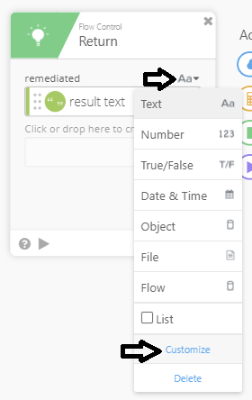

# Special Character Validation and Substitution

## <u>Overview</u>

When using a user’s name to generate technical fields such as
samAccountName and email addresses, often the data will contain
characters that are invalid in the specified data field (such as a space
in an email address). This workflow identifies some of the most common
special characters and provides substitutions. The validated or
remediated name is then placed in a user profile attribute in Okta to
allow for preservation of the original name for display purposes and
utilization of the updated name for technical purposes.

<u>Before you get Started / Prerequisites</u>

Before you get started, here are the things you’ll need:

-   Access to an Okta tenant with Okta Workflows enabled/configured for your org

-   A user with special characters to be replaced

-   A read-write Okta sourced attribute called ValidatedName

<u>Setup Steps</u>

*<u>Workflow 1 – Special Character Replacement</u>*

This workflow can be used to replace or remove unwanted characters in
data, , writing the new data to a specified user profile attribute in
Okta. This workflow will be used in conjunction with a second workflow,
special character validation to identify and replace or remove unwanted
characters for use in technical fields such as email address and AD
samAccountName.

1.  From the folder you wish to create the workflows in

    1.  Click Create a new flow

2.  Click Add Event

    1.  Click Child Flow under Okta Apps

    2.  In the Inputs to this flow field, type **input** (this is case sensitive)

3.  Create a Function card

    1.  In Add Steps to your flow window, click Function

    2.  Search for **Replace Pattern** and select

    3.  Drag the input field from the Child Flow card to the look in field of the replace pattern card

    4.  Leave the replace with field blank

    5.  Leave all instances and case sensitive fields at True

    6.  In the pattern field click to create an input field

        1.  Enter **\~**

    7.  In the pattern field, click again to create an additional field. Name the field input2 (or input3 and so on) Create the below input fields

        1.  **’**

        2.  **\\s** (spaces are a reserved character - see known limitations)

        3.  **\_ (underscore)**

        4.  **\_ (hyphen)**

        5.  **\\.** (periods are a reserved character - see known limitations)

This function card will replace a tilde, apostrophe, a white space
character (blank or tab), underscore, dash, or a period in the field with
nothing. This is especially useful if trying to create an email address
and the name contains spaces.

4.  Create a function card

    1.  Click Function

    2.  Search for **Replace Pattern** and select

    3.  Drag the output field (result text) from the first Replace Pattern card and place it in the look in field of the next pattern card.

    4.  In the replace with field, type **a**

    5.  Leave all instances and case sensitive fields at True

    6.  In the pattern field click to create an input field

        1.  enter **â**

    7.  In the pattern field, click again to create an additional field. Name the field input2 (or input3 and so on) Create the below input fields

        1.  **å**

        2.  **á**

        3.  **ą**

        4.  **ã**

        5.  **à**

5.  Create a function card

    1.  Click Function

    2.  Search for **Replace Pattern** and select

    3.  Drag the output field (result text) from the last Replace Pattern card and place it in the look in field of the next pattern card.

    4.  In the replace with field, type **A**

    5.  Leave all instances and case sensitive fields at True

    6.  In the pattern field click to create an input field

        1.  enter **Â**

    7.  In the pattern field, click again to create an additional field. Name the field input2 (or input3 and so on) Create the below input fields

        1.  **Å**

        2.  **Á**

        3.  **Ą**

        4.  **Ã**

        5.  **À**

Repeat this process for every special character you wish to replace,
noting that Replace Pattern cards are configured to be case sensitive
(as the primary use case is for names). Once you have added all the
desired Replace Pattern cards create a return card.

6.  Create a function card

    1.  Search for **Return** and select

    2.  Drag the output field (result text) from the last Replace Pattern card and drop it in the input field.

    3.  Change label on input field box to remediated

        1.  Click Aa down arrow

 

2.  Click customize

3.  In Display Name, type **remediated**

<!-- -->

7.  Click Save and Name the flow **Special Character Remediation**

8.  Tick the box to Save all data that passes through the flow

9.  Turn the Workflow on

*<u>Workflow 2 – Special Character Validation</u>*

This workflow can be used to identify characters in data which are
potentially problematic in technical fields such as email addresses and
AD samAccountName. This workflow will be used in conjunction with a
second workflow, special character replacement to identify and replace
or remove unwanted characters in data, writing the new data to a
specified user profile attribute in Okta.

1.  From the folder you wish to create the workflows in

    1.  Click Create a new flow

2.  Click Add Event

    1.  Click Okta under My Connected Apps

    2.  Click User Created

3.  In Add steps to your flow, click **App Action**

    1.  Click Okta

    2.  Click Read User

        1.  Under outputs Select First Name

    3.  Drag Okta User ID from User Create Card to User field of Read User Card

4.  Create a Function Card

    1.  Search for **Find Pattern** and select

    2.  Drag First Name from Read User Card and drop in “Look In” field

    3.  In “Look For” field, enter copy/paste the below, including the brackets

        1.  **\[A-Za-z0-9\] -** This is a regular expression that looks for exceptions to the characters listed below. Any character not matching one of these criteria will return a position number that we will use to execute the special character replacement workflow. The acceptable characters are:

            1.  Any capital letter A through Z

            2.  Any lowercase letter a through z

            3.  Any number 0-9

5.  Create a Function Card

    1.  Search for **If/Else** and Select

    2.  Drag position from Find Pattern card and drop into value a of If/else card

    3.  Leave comparison field at “equal to”

    4.  Type **-1** in value b

    5.  Click Save

6.  Click Create outputs

    1.  Click field and type **ValidatedName**

7.  In Run When True box,click **+** and select Function

    1.  Search for **Assign** and select

        1.  Drag First Name from Read User card and drop in input field

        2.  In output field, type **unchanged**

        3.  Drag unchanged field from output box of Assign card to Drag
 true output here box in Outputs section of if/else card

8.  In Run When False box, click **+** and select Function

    1.  Search for **Call Flow** and select

    2.  In Choose Flow box, Select Special Character Removal

    3.  In the input field, drag the First Name field from the Okta Read User Card

    4.  In the output field, type **remediated**

    5.  Drag output field to drag false output here box in Outputs section of if/else

9.  Create an App Action Card

    1.  Select Okta from My Connected Apps

    2.  Search for **Update User** and select

    3.  Select Update Semantics to be partial

    4.  Click Save

    5.  Unselect everything except

        1.  Inputs

            1.  UserID

            2.  Profile **ValidatedName**

    6.  Drag the ID field from the User Create card to the ID field of the Update User card.

10. Click Save and Name the flow **Special Character Validation**

11. Tick the box to Save all data that passes through the flow

12. Turn the Workflow On

<u>Testing this Flow</u>

This is how a builder might test the flow. Here’s what it will look like
when it’s working.

1.  Create an Okta user

    1.  First Name = Wile-E

    2.  Last Name = Coyote

    3.  Use any value you like for email/login name

2.  Open your flow called Special Character Validation and view Flow History

3.  Go to your Okta tenant, open the user Wile-E. In the profile you should see the ValidatedName attribute populated with WileE

<u>Limitations & Known Issues</u>

Many characters have special meaning in regular expressions, such as .,
+, \*, \\ and more. To search for any of those characters you need to
place a \\ before the character. For instance:

-   \\. - finds a period

-   \\s - finds white space (blank or tab)
